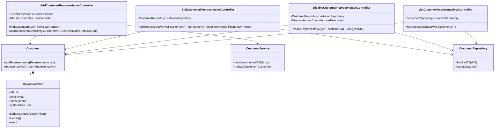

# Class Diagram - Customer Representative Management

## Description

This class diagram shows the main components involved in the Customer Representative Management system:

1. **Controllers**:
   - `AddCustomerRepresentativeController`: Handles adding new representatives
   - `EditCustomerRepresentativeController`: Manages representative information updates
   - `DisableCustomerRepresentativeController`: Handles deactivation of representatives
   - `ListCustomerRepresentativesController`: Retrieves representative information

2. **Domain Objects**:
   - `Customer`: Represents a customer entity that can have multiple representatives
   - `Representative`: Represents a customer representative with their details

3. **Services and Repositories**:
   - `CustomerService`: Business logic for customer operations
   - `CustomerRepository`: Data access for customer entities
