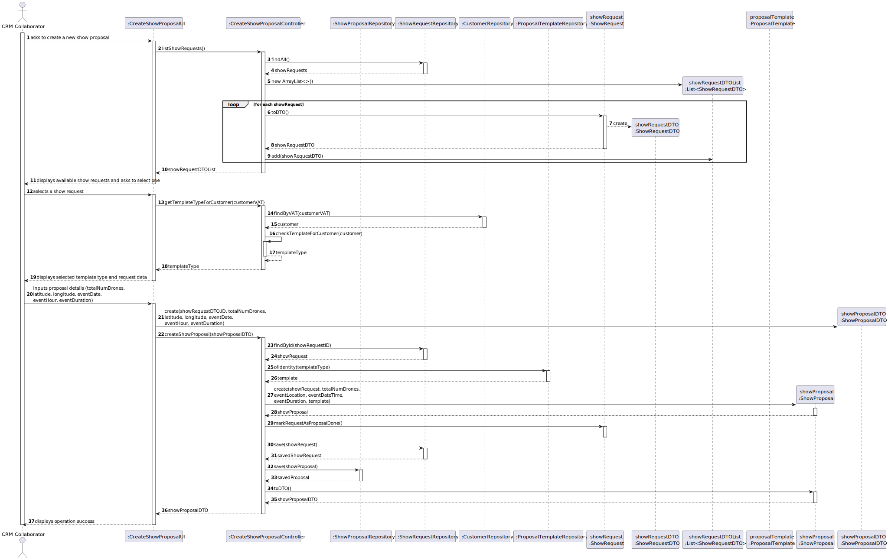
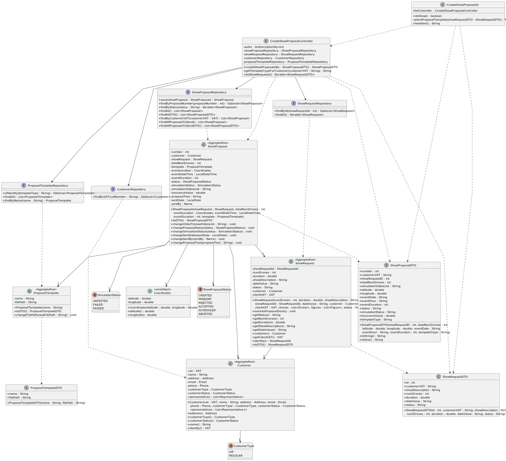

# US310 - Create Show Proposal

## 1. Context

This README covers the implementation of user story US310 for creating show proposals in the system.

### 1.1 List of issues

* US310 Issues: [GitHub issues link](https://github.com/orgs/Departamento-de-Engenharia-Informatica/projects/1100/views/1?pane=issue&itemId=112392219&issue=Departamento-de-Engenharia-Informatica%7Csem4pi-2024-2025-sem4pi_2024_2025_g39%7C348)

## 2. Requirements

### US310 - Create Show Proposal

As CRM Collaborator I want to start the process for creating a show proposal so that we can reply to
the customer. The show proposal includes the total number of drones to be used in the show. Currently, all figures
in a show must use all drones.The show proposal must follow a predefined template.

**Acceptance Criteria:**
- n/a

## 3. Analysis

### 3.1 Business Rules

* Authorization Rules:
    * Only authenticated users with CRM_COLLABORATOR roles can create proposals


* Proposal Rules:
    * The total number of drones must be positive
    * Coordinates must be within valid ranges:
        * Latitude: -90 to 90 degrees
        * Longitude: -180 to 180 degrees
    * Event date and time must be in the future
    * Event duration must be positive
    * A show request must exist
    * A valid template must be selected
    * The proposal status starts as CREATED
    * The simulation status starts as UNTESTED
    * A show request can have more than one proposal


* Template Selection Rules:
    * VIP customers -> VIP template
    * Portuguese customers -> PT template
    * Other customers -> EN template

## 4. Design

### 4.1 Architecture

* Using the standard layered architecture of the application
* Following DDD principles
* Adopting the use of DTOs

### 4.2 Domain Classes

* Aggregate Roots:
    * `ShowProposal` - Main aggregate root with:
        * Identity: Integer (auto-generated)
        * Required associations: Customer, ShowRequest, ProposalTemplate
        * Required value objects: Coordinates
        * Status tracking: ShowProposalStatus, SimulationStatus
    * `Customer` - Independent aggregate
    * `ShowRequest` - Independent aggregate
    * `ProposalTemplate` - Independent aggregate


* Value Objects:
    * `Coordinates` - Part of ShowProposal aggregate


* Enums:
    * `ShowProposalStatus`: CREATED, PENDENT, REJECTED, ACCEPTED, SCHEDULED, ABORTED
    * `SimulationStatus`: UNTESTED, FAILED, PASSED

### 4.3 Controllers and Repositories

* Controller: `CreateShowProposalController`
    * Handles authorization
    * Manages proposal creation process
    * Coordinates between repositories
    * Validates business rules


* Repositories:
    * `ShowProposalRepository` - Manages proposals
    * `ShowRequestRepository` - Manages show requests
    * `CustomerRepository` - Manages customers
    * `ProposalTemplateRepository` - Manages proposal templates

### 4.4 Sequence Diagram


### 4.5 Class Diagram


## 5. Implementation

### Core Components

* Show Proposal Management:
  * `CreateShowProposalController` - Handles show proposal creation process
  * `ShowProposal` - Aggregate root with proposal details
  * Value Objects: `Coordinates`, `ShowProposalStatus`, `SimulationStatus`


* Domain Models:
  * `ShowProposal` - Main aggregate root with proposal details
  * `Coordinates` - Value object for location
  * Enums: `ShowProposalStatus`, `SimulationStatus`


* Repository Layer:
  * `ShowProposalRepository` - Data access interface for proposals
  * `ProposalTemplateRepository` - Data access interface for templates
  * `ShowRequestRepository` - Data access interface for show requests
  * `CustomerRepository` - Data access interface for customers

### UI Components

* Console-based UI classes:
  * `CreateShowProposalUI` - Handles show proposal creation interface
  * `CollaboratorMenu` - Menu integration

## 6. Integration/Demonstration

* The system integrates show proposal creation in the following ways:
  1. Backoffice Application:
     * Menu option for CRM Collaborator to create show proposals
     * Form to collect proposal details
     * Automatic template selection based on customer type
     * Validation of input data (coordinates, dates, etc.)

  2. Integration with other modules:
     * Customer Management - for customer type verification
     * Show Request Management - for request details and status updates

## 7. Testing

### 7.1 Domain Tests

#### ShowProposal Tests (`ShowProposalTest.java`)

**Test 1:** Check that a valid show proposal can be created with all required parameters.
```java
@Test
void ensureCanBuildValidShowProposal() {
    assertNotNull(subject);
}
```

**Test 2:** Verify that show proposal creation fails with null show request.
```java
@Test
void ensureMustHaveShowRequest() {
    assertThrows(IllegalArgumentException.class, () ->
            new ShowProposal(null, validTotalNumDrones, validCoordinates, validEventDateTime, validEventDuration, mockTemplate)
    );
}
```

**Test 3:** Verify that show proposal creation fails with null proposal template.
```java
@Test
void ensureMustHaveProposalTemplate() {
    assertThrows(IllegalArgumentException.class, () ->
            new ShowProposal(mockShowRequest, validTotalNumDrones, validCoordinates, validEventDateTime, validEventDuration, null)
    );
}
```

**Test 4:** Verify that show proposal creation fails with null event date.
```java
@Test
void ensureMustHaveEventDate() {
    assertThrows(IllegalArgumentException.class, () ->
            new ShowProposal(mockShowRequest, validTotalNumDrones, validCoordinates, null, validEventDuration, mockTemplate)
    );
}
```

**Test 5:** Verify that show proposal creation fails with non-positive number of drones.
```java
@Test
void ensureTotalNumDronesMustBePositive() {
    assertThrows(IllegalArgumentException.class, () ->
            new ShowProposal(mockShowRequest, 0, validCoordinates, validEventDateTime, validEventDuration, mockTemplate)
    );
    assertThrows(IllegalArgumentException.class, () ->
            new ShowProposal(mockShowRequest, -10, validCoordinates, validEventDateTime, validEventDuration, mockTemplate)
    );
}
```

**Test 6:** Verify initial status is CREATED and simulation status is UNTESTED.
```java
@Test
void ensureStatusIsCREATED() {
    assertEquals(ShowProposalStatus.CREATED, subject.status());
}
```

**Test 7:** Verify video link management functionality.
```java
@Test
void ensureCanChangeVideo() {
    String videoLink = "http://shodrone.com/video.mp4";
    subject.changeVideoTo(videoLink);
    assertEquals(videoLink, subject.simulationVideoLink());
}

@Test
void ensureCannotChangeVideoToNull() {
    assertThrows(IllegalArgumentException.class, () -> subject.changeVideoTo(null));
}

@Test
void ensureCannotChangeVideoToEmpty() {
    assertThrows(IllegalArgumentException.class, () -> subject.changeVideoTo(""));
}
```

**Test 8:** Verify proposal status management.
```java
@Test
void ensureCanChangeProposalStatus() {
    final ShowProposalStatus newStatus = ShowProposalStatus.PENDENT;
    subject.changeProposalStatus(newStatus);
    assertEquals(newStatus, subject.status());
}

@Test
void ensureCannotChangeProposalStatusToNull() {
    assertThrows(IllegalArgumentException.class, () -> subject.changeProposalStatus(null));
}
```

**Test 9:** Verify simulation status management.
```java
@Test
void ensureCanChangeSimulationStatus() {
    subject.changeSimulationStatus(SimulationStatus.PASSED);
    assertEquals(SimulationStatus.PASSED, subject.simulationStatus());
}

@Test
void ensureCannotChangeSimulationStatusToNull() {
    assertThrows(IllegalArgumentException.class, () -> subject.changeSimulationStatus(null));
}
```

**Test 10:** Verify proposal text management.
```java
@Test
void ensureCanChangeProposalText() {
    String text = "This is a new proposal text.";
    subject.changeProposalText(text);
}
@Test
void ensureCannotChangeProposalTextToEmpty() {
    assertThrows(IllegalArgumentException.class, () -> subject.changeProposalText(""));
}
@Test
void ensureCannotChangeProposalTextToNull() {
    assertThrows(IllegalArgumentException.class, () -> subject.changeProposalText(null));
}
```

#### Coordinates Tests (`CoordinatesTest.java`)

**Test 1:** Verify valid coordinate creation.
```java
@Test
void ensureCanCreateValidCoordinates() {
    new Coordinates(TEST_LATITUDE, TEST_LONGITUDE);
    assertTrue(true);
}
```

**Test 2:** Verify latitude constraints (-90 to 90 degrees).
```java
@Test
void ensureLatitudeCannotBeLessThanMinus90() {
    assertThrows(IllegalArgumentException.class, () -> new Coordinates(-90.1, 0));
}

@Test
void ensureLatitudeCannotBeGreaterThan90() {
    assertThrows(IllegalArgumentException.class, () -> new Coordinates(90.1, 0));
}
```

**Test 3:** Verify longitude constraints (-180 to 180 degrees).
```java
@Test
void ensureLongitudeCannotBeLessThanMinus180() {
    assertThrows(IllegalArgumentException.class, () -> new Coordinates(0, -180.1));
}

@Test
void ensureLongitudeCannotBeGreaterThan180() {
    assertThrows(IllegalArgumentException.class, () -> new Coordinates(0, 180.1));
}
```

### 7.2 Functional Tests

#### Test Case: Create Show Proposal
**ID:** #310;
**Description:** Create a new show proposal

**Prerequisites:**
1. Authenticate as CRM Collaborator
2. Have at least one show request in the system
3. Have templates for different customer types

**Test Steps:**
1. Create a new show proposal normally
   1. Select an available show request
   2. Verify automatic template selection based on customer type
   3. Enter proposal details:
      - Total number of drones: 25
      - Latitude: 12
      - Longitude: 13
      - Event date: 2026-12-12
      - Event time: 12:00
      - Duration: 60
   4. Verify proposal creation success
   5. Verify show request status is updated to "ShowProposalDone"


2. Attempt to create multiple proposals for the same request
    1. Select a show request that already has a proposal
    2. Create another proposal for the same request
    3. Verify that both proposals are successfully created and associated with the request


3. Validate coordinate constraints
   1. Try to create proposal with invalid coordinates:
      - Latitude > 120
      - Latitude < -120
      - Longitude > 190
      - Longitude < -190
   2. System should reject invalid coordinates
   3. System should ask again for the coordinates


4. Validate template selection
   1. Create proposals for different customer types:
      - VIP customer
      - Portuguese customer
      - International customer
   2. Verify correct template is selected for each type


5. Validate event time constraints
    1. Try to create proposals with different time scenarios:
        - Event date in the past
        - Event duration <= 0
    2. System should reject invalid time/duration
    3. System should ask again for the time/duration

## 8. Observations

* The proposal creation process transactional - either all operations succeed or none do
* Template selection is automatic based on customer type:
  * VIP customers get VIP template
  * Portuguese customers get PT template
  * Other customers get EN template
* The system maintains proper state transitions for both proposal and request statuses
* All coordinates are validated to ensure they are within valid ranges
* The proposal is created with initial statuses that will be updated in later USs
