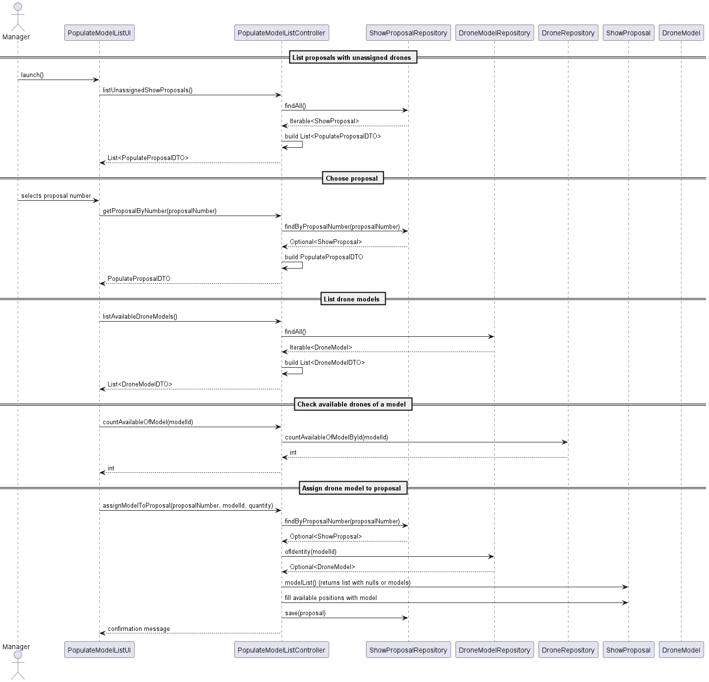

# US311 – Add drones to a proposal

## Objective

Allow a manager to populate a show proposal with available drone models until the total required number of drones has been assigned. This task is carried out through a console interface, interacting with the domain via a dedicated controller.

---

## Class Diagram

### Detailed Explanation

- **PopulateModelListUI**: The entry point of this feature. It interacts with the manager via the console, collects inputs, and calls methods on the controller.
- **PopulateModelListController**:
    - Acts as the application service.
    - Fetches `ShowProposal` instances from the repository.
    - Builds DTOs (`PopulateProposalDTO`, `DroneModelDTO`) to decouple the domain from the UI.
    - Directly accesses the `modelList()` of a `ShowProposal` to assign drone models in available slots.
    - Persists the updated proposal after assignment.
- **ShowProposal**:
    - The core domain entity representing a show proposal.
    - Exposes `modelList()` so the controller can access and modify the list of assigned drone models.
    - Maintains the total number of drones required and the proposal's status.
- **DroneModel**:
    - Represents the type of drone that can be assigned to a proposal.
    - Drone models are stored separately and associated with proposals by position.
- **DTOs**:
    - `PopulateProposalDTO`: Contains summary information (proposal ID, number of drones required and already assigned).
    - `DroneModelDTO`: Used to present available drone models to the UI.
- **Repositories**:
    - `ShowProposalRepository`: Provides access to show proposals.
    - `DroneModelRepository`: Provides access to available drone models.
    - `DroneRepository`: Offers availability statistics (e.g., how many units of a model are available).

---

## Sequence Diagram

### Detailed Explanation

1. **Listing Proposals**: The UI calls `listUnassignedShowProposals()` to retrieve all proposals that still require drone models. The controller queries the repository, filters the results, and builds `PopulateProposalDTO` instances.
2. **Selecting a Proposal**: The manager selects a proposal number, and the UI invokes `getProposalByNumber()`. The controller retrieves the full `ShowProposal` from the repository and returns a summary DTO.
3. **Listing Drone Models**: The UI requests the list of available drone models using `listAvailableDroneModels()`. The controller fetches all models from the `DroneModelRepository` and converts them to `DroneModelDTO`s.
4. **Checking Model Availability**: The manager selects a model, and the UI calls `countAvailableOfModel(modelId)` to check how many drones of that type are ready to use. The controller delegates this to the `DroneRepository`.
5. **Assigning the Model**: The manager inputs a quantity to assign. The UI calls `assignModelToProposal()`. The controller:
    - Loads the proposal and the drone model.
    - Accesses the list of drone models via `modelList()`.
    - Fills available slots with the selected model.
    - Saves the updated proposal via the repository.

---

## Test Coverage

This section documents the test coverage for user story 311 implemented in Sprint 3. Each method is illustrated with an image showing the actual unit test code and assertions.

---

## US311 – Add drones to a proposal

### Class: PopulateModelListControllerTest

This test class verifies the controller’s ability to populate a show proposal with drone models and handle repository interactions correctly.

#### testAssignModelToProposalAssignsCorrectly

Verifies that the controller correctly assigns drone models into available slots in the proposal and persists the changes.

---

#### testCountAvailableOfModelDelegatesToRepo

Ensures the controller correctly delegates the responsibility of counting available drones to the DroneRepository.

---

#### testGetProposalByNumberReturnsNullIfNotFound

Checks that the method getProposalByNumber returns null when the proposal does not exist in the repository.

---

#### testListUnassignedShowProposalsReturnsExpectedDTO

Validates that the method filters proposals and only returns those that still need drones assigned.

---