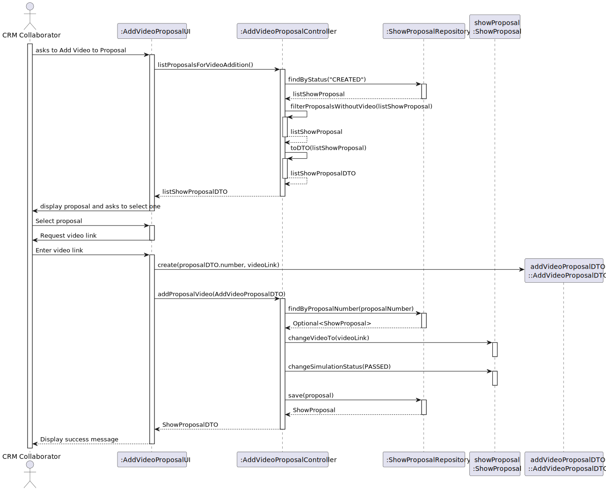
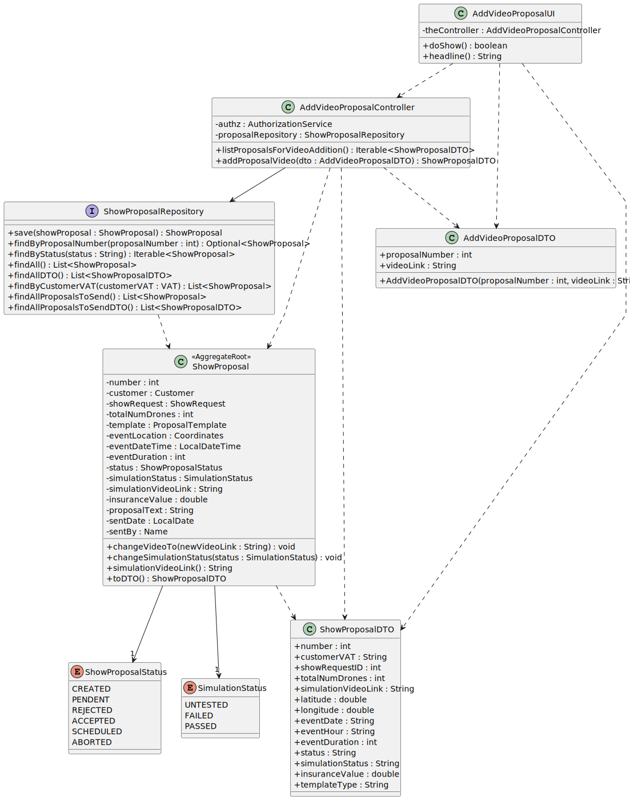

# US315 - Add Video to Proposal

## 1. Context

This README covers the implementation of user story US315 for adding simulation videos to show proposals in the system.

### 1.1 List of issues

* US315 Issues: [GitHub issues link](https://github.com/orgs/Departamento-de-Engenharia-Informatica/projects/1100/views/1?pane=issue&itemId=112392496&issue=Departamento-de-Engenharia-Informatica%7Csem4pi-2024-2025-sem4pi_2024_2025_g39%7C351)

## 2. Requirements

### US315 - Add Video to Proposal

As CRM Collaborator, I want to add a video of the simulated show so the customer can have a preview of the show.

**Acceptance Criteria:**
- n/a

## 3. Analysis

### 3.1 Business Rules

* Authorization Rules:
    * Only authenticated users with CRM_COLLABORATOR role can add videos to proposals


* Video Addition Rules:
    * Only proposals in CREATED status can receive a video
    * Video link cannot be null or empty
    * When a video is added, simulation status is automatically set to PASSED
    * A proposal can only have one video link
    * The system should only display proposals that don't have a video link yet

## 4. Design

### 4.1 Architecture

* Using the standard layered architecture of the application
* Following DDD principles
* Adopting the use of DTOs for data transfer

### 4.2 Domain Classes

* Aggregate Roots:
    * `ShowProposal` - Main aggregate root with:
        * Identity: Integer (auto-generated)
        * Video link
        * Simulation status
        * Status tracking: ShowProposalStatus, SimulationStatus

* Enums:
    * `SimulationStatus`: UNTESTED, FAILED, PASSED
    * `ShowProposalStatus`: CREATED, PENDENT, REJECTED, ACCEPTED, SCHEDULED, ABORTED

### 4.3 Controllers and Repositories

* Controller: `AddVideoProposalController`
    * Handles authorization
    * Manages video addition process
    * Coordinates with repository
    * Validates business rules


* Repositories:
    * `ShowProposalRepository` - Manages proposals and their updates

### 4.4 Sequence Diagram


### 4.5 Class Diagram


## 5. Implementation

### Core Components

* Show Proposal Management:
  * `AddVideoProposalController` - Handles video addition process
  * `ShowProposal` - Aggregate root with video link
  * `AddVideoProposalDTO` - DTO for video addition


* Domain Models:
  * `ShowProposal` - Main aggregate root with video management
  * `SimulationStatus` - Enum for simulation state tracking


* Repository Layer:
  * `ShowProposalRepository` - Data access interface for proposals

### UI Components

* Console-based UI classes:
  * `AddVideoProposalUI` - Handles video addition interface
  * `CollaboratorMenu` - Menu integration

## 6. Integration/Demonstration

* The system integrates video addition in the following ways:
  1. Backoffice Application:
     * Menu option for CRM Collaborator to add videos to proposals
     * List of eligible proposals (CREATED status without video)
     * Form to input video link
     * Automatic status updates

  2. Integration with other modules:
     * Show Proposal Management - for proposal status and video management
     * Authorization System - for role-based access control

## 7. Testing

### 7.1 Domain Tests

#### ShowProposal Tests (`ShowProposalTest.java`)

**Test 1:** Verify video link can be changed.
```java
@Test
void ensureCanChangeVideo() {
    String videoLink = "http://shodrone.com/video.mp4";
    subject.changeVideoTo(videoLink);
    assertEquals(videoLink, subject.simulationVideoLink());
}
```

**Test 2:** Verify video link cannot be null.
```java
@Test
void ensureCannotChangeVideoToNull() {
    assertThrows(IllegalArgumentException.class, () -> subject.changeVideoTo(null));
}
```

**Test 3:** Verify video link cannot be empty.
```java
@Test
void ensureCannotChangeVideoToEmpty() {
    assertThrows(IllegalArgumentException.class, () -> subject.changeVideoTo(""));
}
```

**Test 4:** Verify simulation status can be changed.
```java
@Test
void ensureCanChangeSimulationStatus() {
    subject.changeSimulationStatus(SimulationStatus.PASSED);
    assertEquals(SimulationStatus.PASSED, subject.simulationStatus());
}
```

**Test 5:** Verify simulation status cannot be null.
```java
@Test
void ensureCannotChangeSimulationStatusToNull() {
    assertThrows(IllegalArgumentException.class, () -> subject.changeSimulationStatus(null));
}
```

### 7.2 Functional Tests

#### Test Case: Add Video to Proposal
**ID:** #315
**Description:** Add a simulation video to a show proposal

**Prerequisites:**
1. Authenticate as CRM Collaborator
2. Have at least one proposal in CREATED status without a video

**Test Steps:**
1. Add video to proposal normally
   1. Select a proposal from the list
   2. Enter valid video link
   3. Verify video link is saved
   4. Verify simulation status is updated to PASSED
   5. Verify proposal remains in CREATED status


2. Attempt to add video to invalid proposals
   1. Try to add video to proposals in other statuses
   2. Try to add video to proposals that already have a video
   3. System should not show these proposals in the list


3. Validate video link constraints
   1. Try to add empty video link
   2. System should show error message for the video link


4. Verify status transitions
   1. Add video to a proposal
   2. Verify simulation status changes to PASSED
   3. Verify proposal status remains CREATED
   4. Verify video link is properly stored

## 8. Observations

* The video addition process is transactional - either all operations succeed or none do
* The system maintains proper state transitions for simulation status
* Only proposals in CREATED status without a video are eligible for video addition
* The simulation status is automatically set to PASSED when a video is added
* The system enforces proper authorization through role-based access control
* Video links are validated to ensure they are not empty or null 