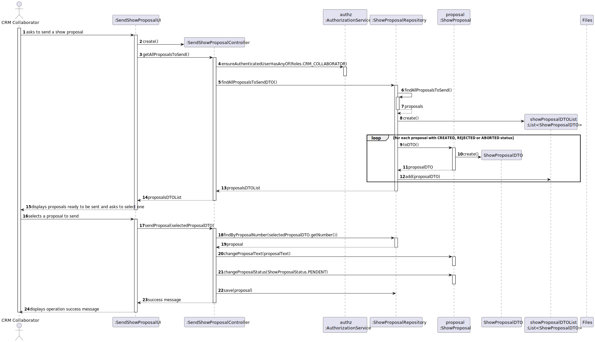
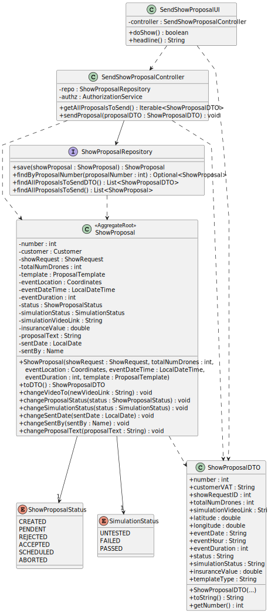

# US316 - Send Show Proposal to Customer

## 1. Context
Este README cobre a implementação da user story US316 para o envio de propostas de show para clientes no sistema.

### 1.1 List of Issues
US316 Issues: [GitHub issues link](https://github.com/Departamento-de-Engenharia-Informatica/sem4pi-2024-2025-sem4pi_2024_2025_g39/issues/352)

## 2. Requirements

### US316 - Send Show Proposal to Customer

As CRM Collaborator, I want to send the show proposal to the customer.

### Acceptance Criteria:
- The proposal must include show details and a video preview link.
- The proposal format must be supported by the system.
- Proposals can only be sent after successful simulation testing.

## 3. Analysis

### 3.1 Business Rules

* Authorization Rules:
  * Only authenticated users with CRM_COLLABORATOR roles can send proposals.


* Proposal Sending Rules:
  * The proposal must have a status of CREATED. 
  * The proposal's simulation status must be PASSED (successful testing). 
  * The proposal document must be formatted using a supported format and generated via the correct plugin.
  * The proposal must include a link to a video preview (a placeholder file can be used as per LAPR4 scope).
  * After sending, the proposal status must be updated to PENDENT.
  * The system must ensure the proposal text is read from a predefined file or template.

## 4. Design

### 4.1 Architecture
- Using the standard layered architecture of the application.
- Following Domain-Driven Design (DDD) principles.
- Adopting the use of DTOs for data transfer.

### 4.2 Domain Classes

* Aggregate Roots:
    * `ShowProposal` - Main aggregate root with:
      * Identity: Integer (auto-generated)
      * Required associations: Customer, ShowRequest, ProposalTemplate
      * Required value objects: Coordinates
      * Status tracking: ShowProposalStatus, SimulationStatus
      * Additional fields: Video link, Proposal text

      * `Customer` - Independent aggregate
      * `ShowRequest` - Independent aggregate
      * `ProposalTemplate` - Independent aggregate

* Value Objects:
    * `Coordinates` - Part of ShowProposal aggregate

* Enums:
    * `ShowProposalStatus`: CREATED, PENDENT, REJECTED, ACCEPTED, SCHEDULED, ABORTED
    * `SimulationStatus`: UNTESTED, FAILED, PASSED

### 4.3 Controllers and Repositories

* Controller: `SendShowProposalController`
    - Handles authorization.
    - Manages the proposal sending process.
    - Validates business rules (e.g., simulation status must be PASSED).
    - Updates proposal status after sending.

* Repositories:
    * `ShowProposalRepository` - Manages proposals and their persistence.

### 4.4 Sequence Diagram


### 4.5 Class Diagram


## 5. Implementation

### Core Components

* Show Proposal Sending:
  * `SendShowProposalController` - Handles the process of sending proposals.
  * `ShowProposal` - Aggregate root with proposal details
  * Value Objects: `ShowProposalStatus`, `SimulationStatus`

* Domain Models:
    * `ShowProposal` - Main aggregate root with proposal details
    * Enums: `ShowProposalStatus`, `SimulationStatus`

* Repository Layer:
    * `ShowProposalRepository` - Data access interface for proposals

### UI Components

* Console-based UI classes:
    * `SendShowProposalUI` - Handles the user interface for sending proposals.
    * `CollaboratorMenu` - Menu integration

## 6. Integration/Demonstration
* The system integrates show proposal creation in the following ways:

  1. Backoffice Application:
        * Menu option for CRM Collaborator to send show proposals.
        * Selection of proposals that are ready to send (simulation status PASSED).
        * Automatic reading of proposal text from a predefined file.
        * Updating of proposal status to PENDENT upon successful sending.
  2. Integration with other modules:
        * Proposal Management - for retrieving and updating proposal details and statuses.
        * File Management - for reading proposal text from files.

## 7. Testing

### 7.1 Domain Tests

#### ShowProposal Tests (`ShowProposalTest.java`)

```java
@Test
void ensureCanUpdateStatusToPendentAfterSending() {
    subject.changeProposalStatus(ShowProposalStatus.PENDENT);
    assertEquals(ShowProposalStatus.PENDENT, subject.status());
}

@Test
void ensureCannotSendIfSimulationNotPassed() {
    subject.changeSimulationStatus(SimulationStatus.UNTESTED);
    assertThrows(IllegalStateException.class, () -> subject.validateForSending());
}

@Test
void ensureCanUpdateProposalText() {
    String newText = "Updated proposal text.";
    subject.changeProposalText(newText);
    assertEquals(newText, subject.proposalText());
}

@Test
void ensureCannotSetNullOrEmptyProposalText() {
    assertThrows(IllegalArgumentException.class, () -> subject.changeProposalText(null));
    assertThrows(IllegalArgumentException.class, () -> subject.changeProposalText(""));
}

@Test
void ensureCanReadProposalTextFromFile() {
    String filePath = "path/to/proposal.txt";
    subject.readProposalTextFromFile(filePath);
    assertNotNull(subject.proposalText());
    assertFalse(subject.proposalText().isEmpty());
}

@Test

```


### 7.2 Functional Tests

#### Test Case: Send Show Proposal

**ID:** #316  
**Description:** Send a show proposal to the customer.

**Prerequisites:**

1. Authenticate as CRM Collaborator. 
2. Have at least one show proposal in the system with simulation status PASSED.
3. Have a predefined proposal text file or template available.

**Test Steps:**

1. Send a show proposal normally:
   1. Select a proposal with simulation status PASSED.
   2. Verify the system reads the proposal text from the designated file.
   3. Verify the proposal status updates to PENDENT after sending.
   4. Confirm successful sending message.
   
2. Attempt to send a proposal with simulation status not PASSED:
   1. Select a proposal with simulation status UNTESTED or FAILED.
   2. Verify the system rejects the sending operation.
   3. Verify the proposal status remains unchanged.

3. Validate proposal text reading:
   1. Ensure the system reads the correct proposal text from the file.
   2. Verify the text is properly associated with the proposal.

4. Validate file format and plugin usage:
   1. Ensure the proposal is generated in a supported format (e.g., text file).
   2. Verify the correct plugin or method is used for formatting.

## 8. Observations

* The proposal sending process is transactional — either all operations succeed or none do.
* No proposal can be sent without a successful simulation (status PASSED).
* Proposal text is read from a predefined file path to simulate document generation in LAPR4 scope.
* The system updates the proposal status to PENDENT upon successful sending.
* Video preview links are included as placeholders as per LAPR4 guidelines (no actual video generation required).
