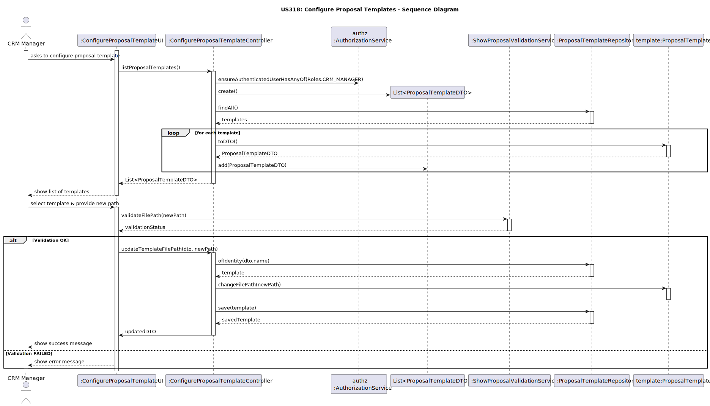
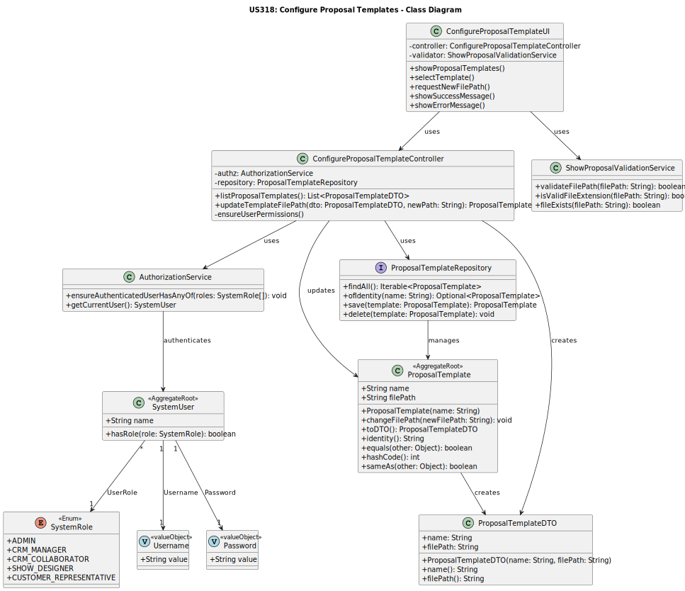

# US318 - Configure Show Proposal Template

## 1. Context
This README covers the implementation of user story US318, which enables CRM Managers to configure the template used to format show proposals sent to customers.

### 1.1 List of Issues
US318 Issues: [GitHub issues link](https://github.com/Departamento-de-Engenharia-Informatica/sem4pi-2024-2025-sem4pi_2024_2025_g39/issues/354)

## 2. Requirements

### US318 - Configure Show Proposal Template

As a CRM Manager, I want to be able to configure the template that formats the show proposal document sent to customers.

### Acceptance Criteria:
- The proposal template must be selected from a list of registered plugins.
- Only CRM Managers can configure the template.
- The selected plugin must be validated and registered in the system.
- The selected template must be stored and associated with future show proposals.
- The template must be applied automatically when generating proposal documents.

## 3. Analysis

### 3.1 Business Rules

* Authorization Rules:
    * Only authenticated users with the CRM_MANAGER role can configure templates.

* Template Configuration Rules:
    * The template plugin must be previously registered and valid.
    * Only one template can be active at a time.
    * The selected template is associated with show proposals upon creation.
    * The system must ensure that only compatible plugins can be selected.

## 4. Design

### 4.1 Architecture
- Follows the standard layered architecture of the application.
- Applies Domain-Driven Design (DDD) principles.
- Uses DTOs for data transfer.

### 4.2 Domain Classes

* Aggregate Roots:

    * `ProposalTemplate` - Represents a registered formatting plugin


### 4.3 Controllers and Repositories

* Controller: `ConfigureProposalTemplateController`
    - Handles the authorization and validation logic.
    - Lists available/registered plugins.
    - Saves the selected template plugin as the active one.

* Repositories:
    * `ProposalTemplateRepository` - Manages persistence of configured templates.

### 4.4 Sequence Diagram


### 4.5 Class Diagram


## 5. Implementation

### Core Components

* Template Configuration:
    * `ConfigureProposalTemplateController` - Entry point for configuring templates
    * `ProposalTemplate` - Aggregate root representing the current configuration

* Repository Layer:
    * `ProposalTemplateRepository` - Saves and loads the configured template

### UI Components

* Console-based UI classes:
    * `ConfigureProposalTemplateUI` - UI for CRM Manager to select a template plugin
    * `ManagerMenu` - Menu integration for CRM Managers

## 6. Integration/Demonstration

* The system integrates template configuration as follows:

    1. Backoffice Application:
        * Menu option for CRM Manager to configure the show proposal template.
        * Displays a list of available and registered plugins.
        * Allows selection and confirmation of the active plugin.
        * Ensures the selected template is stored and used by future proposals.

    2. Integration with other modules:
        * Proposal Management - to retrieve the active template when generating proposals.
        * Plugin System - for managing and validating available formatting plugins.

## 7. Testing

### 7.1 Domain Tests

#### ProposalTemplate Tests (`ProposalTemplateTest.java`)

```java
@BeforeEach
    void setUp() {
        // Initializing valid data for tests
        validName = "Standard Proposal Template";
        validFilePath = "/templates/standard_template.docx";

        // Creating a new instance of ProposalTemplate for each test
        subject = new ProposalTemplate(validName);
    }

@Test
void ensureCanBuildValidProposalTemplate() {
    assertNotNull(subject);
}

@Test
void ensureMustHaveName() {
    assertThrows(IllegalArgumentException.class, () ->
            new ProposalTemplate(null)
    );
}

@Test
void ensureNameCannotBeEmpty() {
    assertThrows(IllegalArgumentException.class, () ->
            new ProposalTemplate("")
    );
}

@Test
void ensureNameCannotBeBlank() {
    assertThrows(IllegalArgumentException.class, () ->
            new ProposalTemplate("   ")
    );
}

@Test
void ensureCanChangeFilePath() {
    String newFilePath = "/templates/new_template.docx";
    subject.changeFilePath(newFilePath);

    ProposalTemplateDTO dto = subject.toDTO();
    assertEquals(newFilePath, dto.filePath());
}

@Test
void ensureCanChangeFilePathToNull() {
    subject.changeFilePath(null);

    ProposalTemplateDTO dto = subject.toDTO();
    assertNull(dto.filePath());
}

@Test
void ensureIdentityReturnsName() {
    assertEquals(validName, subject.identity());
}

@Test
void ensureToDTOWorks() {
    subject.changeFilePath(validFilePath);

    ProposalTemplateDTO dto = subject.toDTO();
    assertEquals(validName, dto.name());
    assertEquals(validFilePath, dto.filePath());
}
``` 
### 7.2 Functional Tests

#### Test Case: Configure Proposal Template

**ID:** #318  
**Description:** Configure the proposal document template used in customer communications.

**Prerequisites:**
1. Authenticate as a CRM Manager.
2. At least one valid plugin must be registered in the system.

**Test Steps:**

1. **Normal configuration flow:**
    1. Login as CRM Manager.
    2. Navigate to the template configuration menu.
   3. Select a template to configure 
   4. Select a valid registered plugin.
     5. Confirm selection.
     6. Validate that the template is saved and used in new proposals.

2. **Attempt configuration with an unregistered plugin:**
    1. Try to select a plugin that is not in the registry.
    2. Validate that the system rejects the selection with an appropriate message.

3. **Validate storage and retrieval:**
    1. Configure a template.
    2. Restart the system or trigger a reload.
    3. Confirm that the configured template persists.

## 8. Observations

* The selected template plugin is critical for proposal formatting consistency.
* CRM Managers are the only role allowed to manage template configuration.
* The plugin system assumes all plugins are validated and registered in advance.
* Proper validation prevents unregistered or incompatible plugins from being applied.
* Template configuration directly impacts the document generated in US316 (proposal sending).

