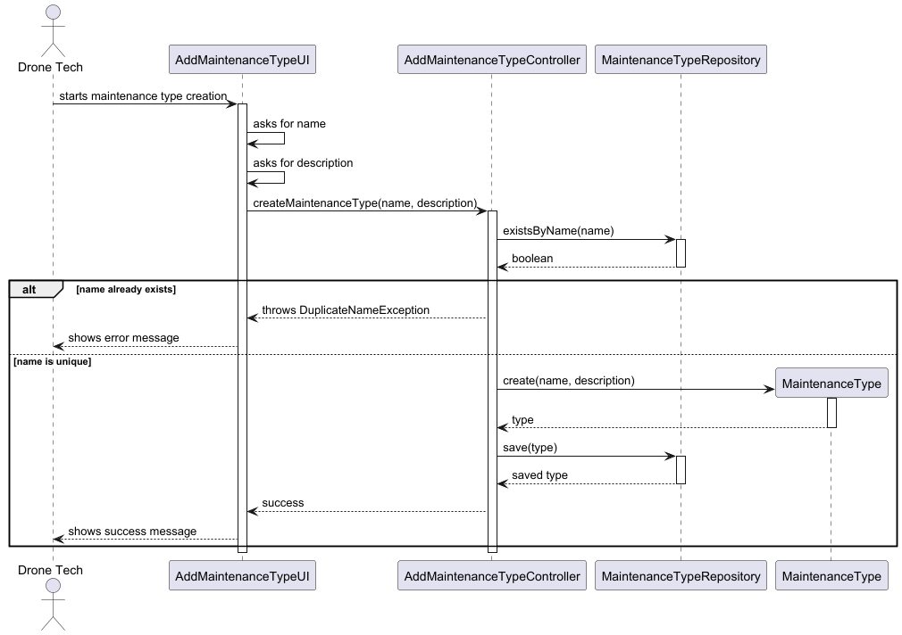
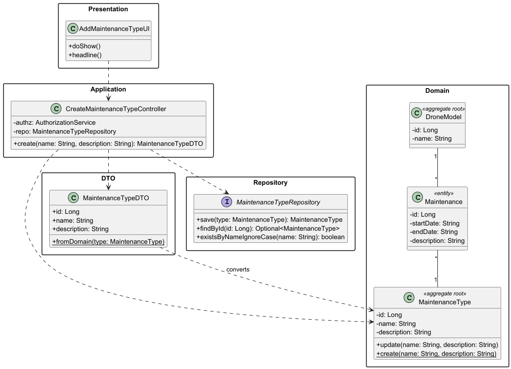

# US321 - Add Maintenance Type

## Objective

Allow a Drone Tech to create new maintenance types that can be applied to any drone model in the system. Each maintenance type has a unique name and description, and once created, it becomes available for scheduling maintenance operations across all drone models.

## 1. Context

This README covers the implementation of user story US321 for adding maintenance types in the system.

### 1.1 List of issues

* Analysis: [GitHub issue link](https://github.com/Departamento-de-Engenharia-Informatica/sem4pi-2024-2025-sem4pi_2024_2025_g39/issues/410#issue-3091389011)
* Design: [GitHub issue link](https://github.com/Departamento-de-Engenharia-Informatica/sem4pi-2024-2025-sem4pi_2024_2025_g39/issues/412#issue-3091389783)
* Implement: [GitHub issue link](https://github.com/Departamento-de-Engenharia-Informatica/sem4pi-2024-2025-sem4pi_2024_2025_g39/issues/413#issue-3091391650)
* Test: [GitHub issue link](https://github.com/Departamento-de-Engenharia-Informatica/sem4pi-2024-2025-sem4pi_2024_2025_g39/issues/414#issue-3091392173)

.
## 2. Requirements

### US321 - Add Maintenance Type

**As** a Drone Tech
**I want** to add a maintenance type
**So that** it can be applied to all drone models

**Acceptance Criteria:**
- The maintenance type must be applicable to all drone models
- Only authorized Drone Techs can add maintenance types
- Basic validation for name and description must be performed

## 4. Design

### 4.1. Maintenance Type Registration

- **Sequence Diagram**
- **Class Diagram**

### 4.2. Component Details

- **AddMaintenanceTypeUI**:
    - Handles user interaction through the console
    - Collects name and description inputs
    - Displays success/error messages
- **CreateMaintenanceTypeController**:
    - Orchestrates the creation flow
    - Validates user authorization (DRONE_TECH role)
    - Checks for name uniqueness
    - Creates and persists new maintenance types
- **MaintenanceType**:
    - Core domain entity for maintenance types
    - Enforces validation rules:
        - Name: 1-50 chars, alphanumeric with spaces/hyphens
        - Description: 1-1000 chars
    - Implements value equality based on ID
- **MaintenanceTypeRepository**:
    - Provides persistence operations
    - Supports case-insensitive name uniqueness checks
    - Handles CRUD operations

### 4.3. Applied Patterns

* Domain-Driven Design (DDD):
  * Aggregate Root (MaintenanceType)
  * Value Objects (Name, Description)
  * Repositories
  * Factory Methods

* GRASP:
  * Controller
  * Information Expert
  * Creator
  * Low Coupling
  * High Cohesion

## 5. Implementation

### Core Components

* Maintenance Type Management:
  * `CreateMaintenanceTypeController` - Handles type registration
  * `MaintenanceTypeService` - Business logic for maintenance types
  * `MaintenanceType` - Domain entity with validation

* Domain Models:
  * `MaintenanceType` - Aggregate root for maintenance types
  * Value Objects: `Name`, `Description`

* Repository Layer:
  * `MaintenanceTypeRepository` - Data access interface
  * `JpaMaintenanceTypeRepository` - JPA implementation
  * `InMemoryMaintenanceTypeRepository` - In-memory implementation

### UI Components

* Console-based UI classes:
  * `AddMaintenanceTypeUI` - Handles type registration
  * `AddMaintenanceTypeAction` - Menu action implementation
  * `DroneTechMenu` - Menu integration

## 6. Integration/Demonstration

* The system integrates maintenance type registration in two ways:
  1. Backoffice Application:
     * Menu option for Drone Technicians to register types
     * Form to collect type data with validation

  2. Maintenance Scheduling:
     * Types are available when scheduling maintenance for drone models
     * Types can be reused across different drone models

## 7. Observations

* Authorization is handled at the controller level
* Names are checked for uniqueness before registration
* The system supports future extension for type categorization
* All operations are transactional to ensure data consistency
