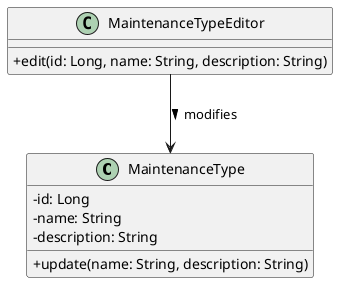
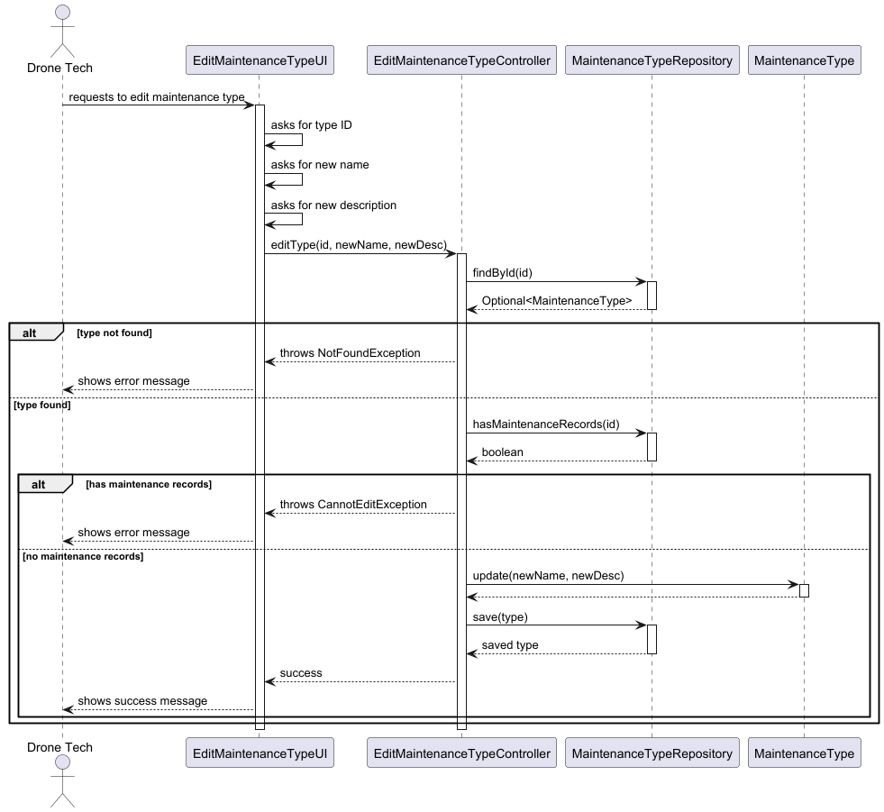
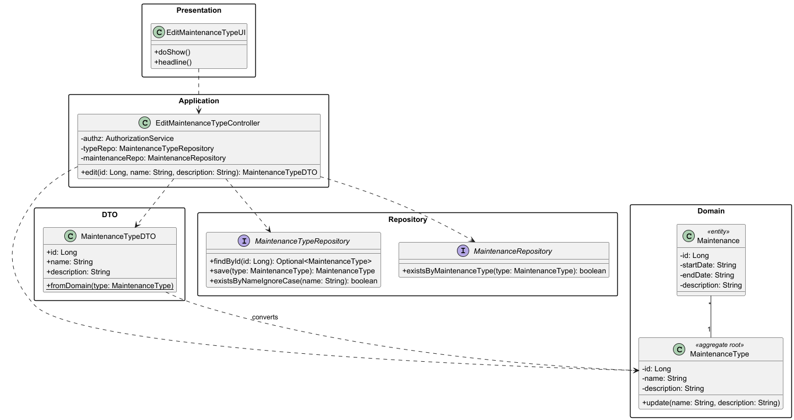

# US323 - Edit Maintenance Type

## Objective

Allow a Drone Tech to modify existing maintenance types that have no associated maintenance records. This ensures that maintenance type definitions can be corrected or updated while maintaining data integrity by preventing changes to types that are already in use.

## 1. Context

This README covers the implementation of user story US323 for editing maintenance types in the system.

### 1.1 List of issues

* Analysis: [GitHub issue link](https://github.com/Departamento-de-Engenharia-Informatica/sem4pi-2024-2025-sem4pi_2024_2025_g39/issues/421#issue-3091395474)
* Design: [GitHub issue link](https://github.com/Departamento-de-Engenharia-Informatica/sem4pi-2024-2025-sem4pi_2024_2025_g39/issues/422#issue-3091395915)
* Implement: [GitHub issue link](https://github.com/Departamento-de-Engenharia-Informatica/sem4pi-2024-2025-sem4pi_2024_2025_g39/issues/423#issue-3091396466)
* Test: [GitHub issue link](https://github.com/Departamento-de-Engenharia-Informatica/sem4pi-2024-2025-sem4pi_2024_2025_g39/issues/424#issue-3091396769)

## 2. Requirements

### US323 - Edit Maintenance Type

**As** a Drone Tech
**I want** to edit an existing maintenance type

**Acceptance Criteria:**
- Only maintenance types without stored maintenance records can be edited
- Only authorized Drone Techs can edit maintenance types
- Basic validation for updated information must be performed

## 3. Analysis

### **US323 DM Excerpt**

## 4. Design

### 4.1. Maintenance Type Editing

- **Sequence Diagram**

- **Class Diagram**

### 4.2. Component Details

- **EditMaintenanceTypeUI**:
    - Handles user interaction through the console
    - Collects ID of type to edit
    - Gathers new name and description
    - Displays success/error messages
- **EditMaintenanceTypeController**:
    - Orchestrates the editing flow
    - Validates user authorization (DRONE_TECH role)
    - Checks for existing maintenance records
    - Verifies name uniqueness
    - Updates and persists changes
- **MaintenanceType**:
    - Core domain entity for maintenance types
    - Enforces validation rules on updates
    - Manages state changes
- **MaintenanceTypeDTO**:
    - Data transfer object for maintenance types
    - Handles domain object conversion
    - Contains update operation results
- **Repositories**:
    - MaintenanceTypeRepository: Handles type persistence
    - MaintenanceRepository: Checks for existing records

### 4.3. Applied Patterns

* Domain-Driven Design (DDD):
  * Aggregate Root (MaintenanceType)
  * Repository Pattern
  * Domain Events

* GRASP:
  * Controller
  * Information Expert
  * Protected Variations
  * Low Coupling
  * High Cohesion

## 5. Implementation

### Core Components

* Edit Management:
  * `EditMaintenanceTypeController` - Handles type editing
  * `MaintenanceType` - Domain entity with update logic
  * `MaintenanceTypeDTO` - Data transfer object

* Repository Layer:
  * `MaintenanceTypeRepository` - Type persistence
  * `MaintenanceRepository` - Record checking
  * Transactional operations

### UI Components

* Console-based UI classes:
  * `EditMaintenanceTypeUI` - Handles editing interface
  * Input validation and formatting
  * Clear error messages

## 6. Integration/Demonstration

* The editing functionality is integrated in two ways:
  1. Direct Menu Option:
     * Available in the Drone Tech menu
     * Full editing capabilities
  2. Supporting Feature:
     * Used in maintenance planning
     * Helps maintain accurate type definitions

## 7. Observations

* Validation ensures data integrity
* Clear error messages for business rule violations
* Transaction boundaries properly defined
