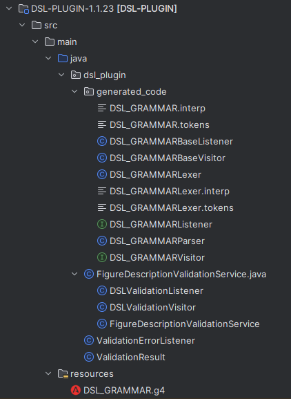

# US340 - DSL Plugin

## 1. Context

This README covers the implementation of user story US340 for deploying and configuring a DSL (Domain Specific Language) plugin to analyze figure high-level descriptions in the system.

### 1.1 List of issues

* US340 Issues: [GitHub issues link](https://github.com/orgs/Departamento-de-Engenharia-Informatica/projects/1100/views/1?pane=issue&itemId=112393174&issue=Departamento-de-Engenharia-Informatica%7Csem4pi-2024-2025-sem4pi_2024_2025_g39%7C362)

## 2. Requirements

### US340 - DSL Plugin

As a Drone Tech, I want to deploy and configure a plugin to be used by the system to analyze the figure high-level description.

**Acceptance Criteria:**
- n\a

## 3. Analysis

### 3.2 Plugin Structure


### 3.2 Business Rules

* Plugin Rules:
    * The plugin must be versioned (currently 1.1.23)
    * The grammar must support both show and figure definitions
    * The plugin must generate parser and lexer classes
    * The plugin must be compatible with Java 17
    * The plugin must use ANTLR4 for grammar processing


* Grammar Rules:
    * Must support DSL version declaration
    * Must support show definitions with drone sections and sequences
    * Must support standalone figure definitions
    * Must support various figure types (Line, Rectangle, Circle, Circumference)
    * Must support drone type declarations and mappings
    * Must support position, velocity, and distance declarations
    * Must support action statements (lights, movement, rotation)
    * Must support block statements (before, after, group)

## 4. Design

### 4.1 Architecture

* Using ANTLR4 for grammar definition and parser generation
* Following Maven plugin architecture

### 4.2 Grammar Structure

* Program Structure:
    * DSL version declaration
    * Show definition or standalone figure
    * Show definition includes:
        * Drones section (model and quantity mapping)
        * Sequence section (figure definitions)
    * Figure definition includes:
        * Mapping section (drone type mapping)
        * Declarations (drone types, positions, velocities)
        * Statements (actions and blocks)


* Key Grammar Components:
    * `program`: Entry point for both shows and figures
    * `show_definition`: Defines a complete show with drones and sequence
    * `figure_standalone`: Defines a single figure
    * `drones_section`: Maps drone models to quantities
    * `sequence_section`: Defines the sequence of figures
    * `mapping_section`: Maps logical drone types to actual models
    * `declarations`: Defines drone types, positions, velocities
    * `statements`: Defines actions and control blocks

### 4.3 Generated Code Structure

* Generated Classes:
    * `DSL_GRAMMARParser`: Main parser class
    * `DSL_GRAMMARLexer`: Token lexer
    * `DSL_GRAMMARBaseListener`: Base listener implementation
    * `DSL_GRAMMARBaseVisitor`: Base visitor implementation
    * `DSL_GRAMMARVisitor`: Visitor interface

## 5. Implementation

### Core Components

* Grammar Definition:
    * `DSL_GRAMMAR.g4`: ANTLR4 grammar file
    * Defines all language constructs
    * Supports both show and figure definitions
    * Includes lexer and parser rules


* Build Configuration:
    * `pom.xml`: Maven configuration
    * ANTLR4 plugin configuration
    * Source directory management
    * Dependency management


* Generated Code:
    * Located in `src/main/java/dsl_plugin/generated_code`
    * Automatically generated during build
    * Includes parser, lexer, and visitor classes

## 6. Integration/Demonstration

* The plugin integrates into the system in the following ways:
  1. Build Process Integration:
     * Plugin is built as part of the main project
     * Generated classes are available to other modules
     * Spring context manages plugin components

  2. Usage in Other Modules:
     * Show definition parsing
     * Figure validation
     * Drone sequence analysis

## 7. Testing

### 7.1 Grammar Tests

The grammar was validated using three sample DSL files that demonstrate different figure definitions and show capabilities:

#### Test Case: Testing with sample_DSL_figure_1
**ID:** #340.1
**Description:** Parse a complex figure with line and rectangle shapes (`sample_DSL_figure_1.txt`)

**Test Steps:**
1. Parse figure definition with multiple shapes and actions:
   ```dsl
   DSL version 1.1.23;
   
   DroneType droneTypeA;
   
   Position aPos = (0,0,0);
   Position anotherPos = (0, 10, 0);
   Position zAxis = (0,0,1);
   
   Velocity aVelocity = 5.1;
   Velocity rotVelocity = PI/10;
   
   Distance aLenght = 20;
   
   Line aLine(aPos, aLenght, droneTypeA);
   Rectangle aRectangle(anotherPos, aLenght, aLenght, droneTypeA);
   
   before
       aLine.lightsOn(YELLOW);
       aLine.move((0, 0, 1),30, aVelocity);
       aRectangle.lightsOn(GREEN);
       aRectangle.move((0, 0, 1),40, aVelocity);
   endbefore
   
   group
       aLine.rotate(aPos, zAxis, 2*PI, rotVelocity);
       aRectangle.rotate(aPos, zAxis, -2*PI, rotVelocity);
   endgroup
   
   pause(10);
   
   aLine.lightsOn(RED);
   aRectangle.lightsOn(RED);
   
   after
       aLine.move((0, 0, -1),30, aVelocity);
       aRectangle.move((0, 0, -1),40, aVelocity);
       aLine.lightsOff;
       aRectangle.lightsOff;
   endafter
   ```
2. Verify parsing success
3. Verify correct structure recognition
4. Verify all actions are properly parsed:
   - Light control (YELLOW, GREEN, RED)
   - Movement in 3D space
   - Rotation around z-axis
   - Pause command
   - Before/after blocks
   - Group block

---

#### Test Case: Testing with sample_DSL_figure_2
**ID:** #340.2
**Description:** Parse a figure with a single rectangle shape (`sample_DSL_figure_2.txt`)

**Test Steps:**
1. Parse figure definition with single shape:
   ```dsl
   DSL version 1.1.23;
   
   DroneType droneTypeA;
   
   Position aPos = (0,0,0);
   Position anotherPos = (0, 10, 0);
   Position yAxis = (0,1,0);
   
   Velocity aVelocity = 6;
   Velocity rotVelocity = PI/10;
   
   Distance aLenght = 20;
   
   Rectangle aRectangle(anotherPos, aLenght, aLenght, droneTypeA);
   
   before
      aRectangle.lightsOn(GREEN);
      aRectangle.move((0, 0, 1),50, aVelocity);
   endbefore
   
   aRectangle.rotate(aPos, yAxis, -2*PI, rotVelocity);
   
   pause(10);
   
   aRectangle.lightsOn(RED);
   
   after
      aRectangle.move((0, 0, -1),50, aVelocity);
      aRectangle.lightsOff;
   endafter
   ```
2. Verify parsing success
3. Verify correct structure recognition
4. Verify all actions are properly parsed:
   - Light control (GREEN, RED)
   - Vertical movement
   - Rotation around y-axis
   - Pause command
   - Before/after blocks

---
#### Test Case: Testing with sample_DSL_figure_3
**ID:** #340.3
**Description:** Parse a figure with circle and circumference shapes (`sample_DSL_figure_3.txt`)

**Test Steps:**
1. Parse figure definition with circular shapes:
   ```dsl
   DSL version 1.1.23;
   
   DroneType droneTypeA;
   
   Position aPos = (0,0,0);
   Position yAxis = (0,1,0);
   
   Velocity aVelocity = 6;
   Velocity rotVelocity = PI/10;
   
   Distance aRadius = 19;
   
   Circle aCircle(aPos, aRadius, droneTypeA);
   Circumference aCircumference(aPos, aRadius+1, droneTypeA);
   
   before
      aCircle.lightsOn(GREEN);
      aCircumference.lightsOn(RED);
      group
         aCircle.move((0, 0, 1),50, aVelocity);
         aCircumference.move((0, 0, 1),50, aVelocity);
      endgroup
   endbefore
   
   group
      aCircle.rotate(aPos, yAxis, -2*PI, rotVelocity);
      aCircumference.rotate(aPos, yAxis, 2*PI, rotVelocity);
   endgroup
   
   pause(10);
   
   aCircle.lightsOn(RED);
   aCircumference.lightsOn(GREEN);
   
   after
      group
         aCircle.movePos(aPos, aVelocity);
         aCircumference.movePos(aPos, aVelocity);
      endgroup
      aCircle.lightsOff;
      aCircumference.lightsOff;
   endafter
   ```
2. Verify parsing success
3. Verify correct structure recognition
4. Verify all actions are properly parsed:
   - Light control (GREEN, RED)
   - Movement in 3D space
   - Rotation around y-axis
   - Nested group blocks
   - MovePos command
   - Before/after blocks

### 7.2 Test Results

All three test files were successfully parsed by the grammar, validating:
* Support for all figure types (Line, Rectangle, Circle, Circumference)
* Support for all action types (lights, movement, rotation)
* Support for control structures (before, after, group blocks)
* Support for mathematical expressions (PI, arithmetic)
* Support for 3D coordinates
* Support for velocity and distance declarations
* Support for pause commands
* Proper handling of nested blocks
* Proper handling of multiple shapes in a single figure

## 8. Observations

* Generated code is placed in a specific package for organization
* The grammar supports both show and figure definitions
* The plugin is built as a Maven module
* The plugin can be used with the generater .jar file in the /target folder
* The build process is automated through Maven plugins
