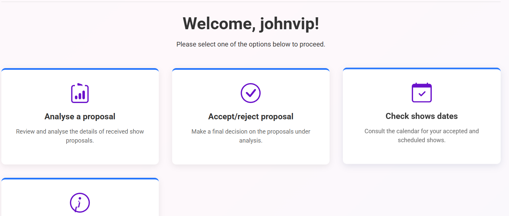
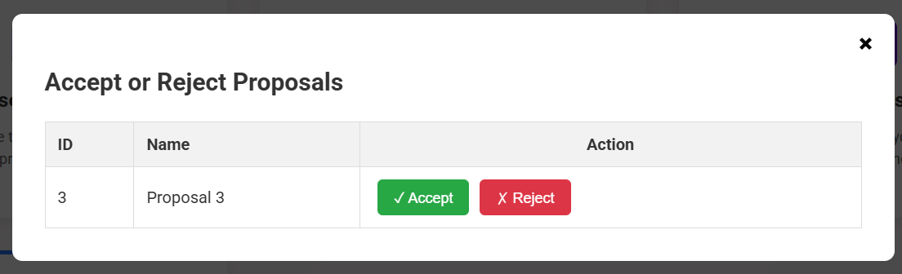
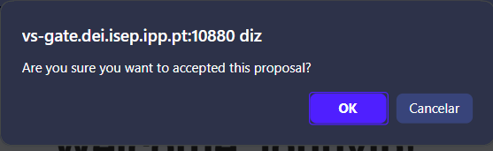

# US371 - Accept/Reject Proposal

## 1. Context

This README covers the implementation of user story US371 for accepting or rejecting proposals in the Customer App system.

### 1.1 List of issues

* US371 Issues: [GitHub issues link](https://github.com/Departamento-de-Engenharia-Informatica/sem4pi-2024-2025-sem4pi_2024_2025_g39/issues/343)

## 2. Requirements

### US371 - Accept/Reject Proposal

As a Customer, I want to accept/reject a proposal using the Customer App. I may provide feedback.

**Acceptance Criteria:**
- Customer Representatives can accept or reject pending proposals
- System provides confirmation before processing the decision
- Optional feedback can be provided, especially for rejections
- Accepted proposals become available for detailed viewing
- The system maintains proposal state changes appropriately

## 3. Analysis

### 3.1 Business Rules

* Authorization Rules:
    * Only authenticated users with CUSTOMER_REPRESENTATIVE role can accept/reject proposals
    * Users can only access proposals associated with their customer account
    * Each proposal can only be accepted or rejected once

* Proposal State Management:
    * Proposals start in PENDING state when submitted
    * After customer decision, proposals transition to ACCEPTED or REJECTED state
    * Accepted proposals become available in the shows schedule
    * Rejected proposals are archived but not displayed in active lists

* Decision Process Rules:
    * Confirmation dialog must be displayed before processing any decision
    * Feedback is optional for all decisions but commonly used for rejections
    * No time limit exists for making decisions on pending proposals
    * No character limit on feedback text
    * Decision timestamp and user information are recorded

## 4. Design

### 4.1 Architecture

* Client-Server Architecture:
    * Customer App (Client):
        * Web-based frontend using HTML, CSS, and JavaScript
        * Modal-based interface for proposal decision workflow
        * Real-time confirmation dialogs for user decisions
        * Session-based authentication management
    * Customer App Server:
        * Java-based HTTP server using Berkeley Sockets API
        * RESTful endpoints for proposal management
        * Database transaction management for state changes
        * Role-based access control enforcement
    * Database:
        * H2 Database with proposal state tracking
        * Decision history logging
        * Customer-proposal association management

* Communication Protocol:
    * HTTP over TCP sockets
    * JSON-based request/response format
    * Endpoints:
        * GET /proposals?user={username} - Retrieve pending proposals
        * POST /proposal/decision - Submit accept/reject decision
        * POST /login - Authentication
    * Security:
        * Role-based access control (CUSTOMER_REPRESENTATIVE)
        * Session management using browser's sessionStorage
        * Request validation and sanitization

* Component Interaction:
    * Customer App → Customer App Server:
        * Fetch pending proposals for decision
        * Submit decision with optional feedback
        * Authentication and session management
    * Customer App Server → Database:
        * Query pending proposals by customer
        * Update proposal status and record decision
        * Log decision history with timestamp and user

## 5. Implementation

### Core Components

* Server Components:
    * `CustomerAppHttpServer.java`:
        * HTTP server implementation
        * Request routing for proposal decisions
        * Session and authentication management
    * `CustomerAppRequest.java`:
        * Proposal decision processing logic
        * Database interaction for status updates
        * Authorization validation
        * Response formatting
    * `HTTPmessage.java`:
        * HTTP protocol implementation
        * JSON request/response handling
        * Error response management

* Client Components:
    * `dashboard.html`:
        * Main application interface
        * Modal container for decision workflow
        * Confirmation dialog elements
    * `dashboard.js`:
        * `showAcceptRejectModal()`: Loads and displays pending proposals
        * `populateAcceptRejectTable()`: Creates interactive proposal table
        * `submitDecision()`: Handles accept/reject decision submission
        * Confirmation dialog management
        * Error handling and user feedback
    * `auth.js`:
        * Session management
        * Role-based access control
        * Authentication state validation

### Key Functions

#### Frontend Implementation
```javascript
// Main function to display proposals for decision
async function showAcceptRejectModal() {
    // Fetches pending proposals for authenticated user
    // Displays loading state during request
    // Handles server errors gracefully

    const username = sessionStorage.getItem('loggedInUser');
    modalTitle.innerText = 'Accept or Reject Proposals';
    modalContent.innerHTML = '<p>Loading proposals for decision...</p>';
    modal.style.display = 'flex';
    try {
        const response = await fetch(`/proposals?user=${username}`);
        if (!response.ok) throw new Error('Server error!');
        const proposals = await response.json();
        populateAcceptRejectTable(proposals);
    } catch (error) {
        console.error('Failed to fetch proposals for decision:', error);
        modalContent.innerHTML = '<p>Could not fetch proposals from the server.</p>';
    }
}

// Creates interactive table with decision buttons
function populateAcceptRejectTable(proposals) {
    // Generates table with Accept/Reject buttons
    // Handles empty proposal lists
    // Provides clear visual indicators for actions

    if (proposals.length === 0) {
        modalContent.innerHTML = '<p>There are no proposals awaiting a decision.</p>';
        return;
    }
    let tableHTML = `<table class="proposals-table"><tr><th>ID</th><th>Name</th><th style="text-align:center;">Action</th></tr>`;
    proposals.forEach(p => {
        tableHTML += `<tr><td>${p.id}</td><td>${p.name}</td><td class="decision-buttons"><button class="accept-btn" onclick="submitDecision('${p.id}', 'ACCEPTED')">✓ Accept</button><button class="reject-btn" onclick="submitDecision('${p.id}', 'REJECTED')">✗ Reject</button></td></tr>`;
    });
    tableHTML += '</table>';
    modalContent.innerHTML = tableHTML;
}

// Processes user decision with confirmation
async function submitDecision(proposalId, decision) {
    // Shows confirmation dialog before processing
    // Sends POST request with decision data
    // Refreshes view after successful submission
    // Handles network and server errors

    if (!confirm(`Are you sure you want to ${decision.toLowerCase()} this proposal?`)) return;
    const payload = { id: parseInt(proposalId), status: decision };
    try {
        const response = await fetch('/proposal/decision', {
            method: 'POST',
            headers: {'Content-Type': 'application/json'},
            body: JSON.stringify(payload)
        });
        if (response.ok) {
            alert('Decision submitted successfully!');
            showAcceptRejectModal();
        } else {
            alert(`Error: ${await response.text()}`);
        }
    } catch (error) {
        alert('A network error occurred.');
        console.error('Fetch error:', error);
    }
}
```

#### Request/Response Format
* **Request**: `POST /proposal/decision`
  ```json
  {
    "id": 123,
    "status": "ACCEPTED" | "REJECTED",
    "feedback": "Optional feedback text"
  }
  ```
* **Response**: HTTP 200 (success) or error code with message

## 6. Integration/Demonstration

* The accept/reject proposal functionality integrates seamlessly with:
    1. Customer Authentication System:
        * Role-based access control
        * Session management
        * User identification for proposal filtering

    2. Proposal Management System:
        * Pending proposal retrieval
        * State transition management
        * Decision history tracking

    3. Show Scheduling System:
        * Accepted proposals become available for scheduling
        * Integration with show details viewing (US373)
        * Calendar and scheduling workflows

## 7. Testing

### 7.1 Functional Tests

#### Test Case: Accept Proposal
**ID:** #371-001
**Description:** Successfully accept a pending proposal

**Prerequisites:**
1. Authenticate as Customer Representative
2. Have at least one pending proposal

**Test Steps:**
1. Access Accept/Reject Proposals functionality
2. Verify pending proposals are displayed
3. Click "Accept" button for a proposal
4. Confirm the decision in the confirmation dialog
5. Verify success message is displayed
6. Verify proposal is removed from pending list
7. Verify proposal appears in scheduled shows

**Expected Results:**
- Proposal status changes to ACCEPTED
- Success confirmation is displayed
- Proposal becomes available for show scheduling

#### Test Case: Reject Proposal with Feedback
**ID:** #371-002
**Description:** Reject a proposal with optional feedback

**Prerequisites:**
1. Authenticate as Customer Representative
2. Have at least one pending proposal

**Test Steps:**
1. Access Accept/Reject Proposals functionality
2. Click "Reject" button for a proposal
3. Confirm the decision in the confirmation dialog
4. Verify success message is displayed
5. Verify proposal is removed from pending list

**Expected Results:**
- Proposal status changes to REJECTED
- Feedback is recorded in the system
- Proposal is archived and not shown in active lists

#### Test Case: Authorization Control
**ID:** #371-003
**Description:** Verify only authorized users can make decisions

**Prerequisites:**
1. User without CUSTOMER_REPRESENTATIVE role

**Test Steps:**
1. Attempt to access proposal decision functionality
2. System should prevent access or show empty results

**Expected Results:**
- Unauthorized users cannot access proposal decisions
- Appropriate error handling is displayed

#### Test Case: Confirmation Dialog
**ID:** #371-004
**Description:** Verify confirmation dialog prevents accidental decisions

**Prerequisites:**
1. Authenticate as Customer Representative
2. Have pending proposals

**Test Steps:**
1. Click Accept or Reject button
2. Cancel the confirmation dialog
3. Verify no action is taken
4. Repeat with confirmation
5. Verify action is processed

**Expected Results:**
- Confirmation dialog appears before processing
- Canceling prevents any changes
- Confirming processes the decision

### 7.2 User Interface Flow

1. **Access Functionality**
    - User clicks "Accept/Reject Proposal" button
    - Modal opens with loading indicator
      

2. **View Pending Proposals**
    - Table displays all pending proposals
    - Each row shows ID, Name, and Action buttons
    - Clear visual distinction between Accept/Reject buttons
      
3. **Make Decision**
    - User clicks Accept (✓) or Reject (✗) button
    - Confirmation dialog appears with clear message
    - User confirms or cancels the action
      

4. **Process Result**
    - Success message displays upon completion
    - Proposal list refreshes automatically
    - Modal remains open for additional decisions

## 8. Observations

* The proposal decision system provides a secure and user-friendly interface for managing proposals
* Confirmation dialogs prevent accidental decisions and improve user experience
* The system maintains proper audit trails by recording decision timestamps and user information
* Integration with existing authentication and authorization systems ensures proper access control
* Real-time updates keep the interface current after decisions are made
* Error handling provides clear feedback for network issues or server problems
* The modal-based interface allows for efficient batch processing of multiple proposals
* Visual indicators (✓ for accept, ✗ for reject) make the interface intuitive
* Automatic list refresh after decisions improves workflow efficiency
* The system gracefully handles edge cases like empty proposal lists
* Session management ensures decisions are properly attributed to authenticated users