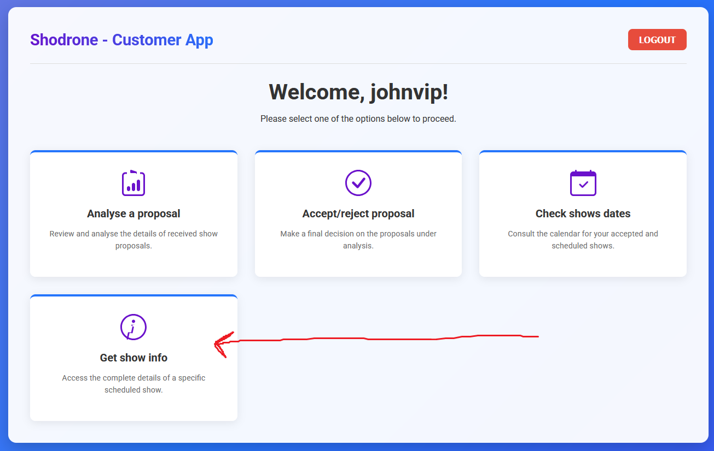
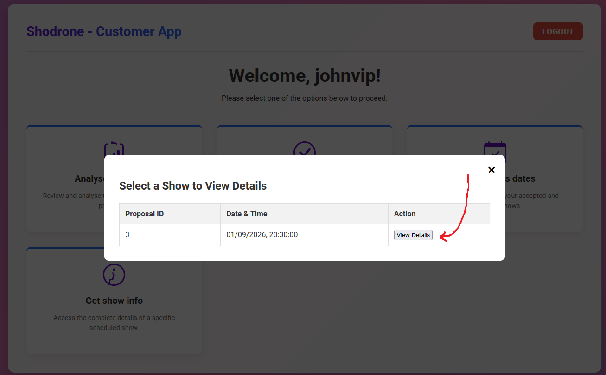
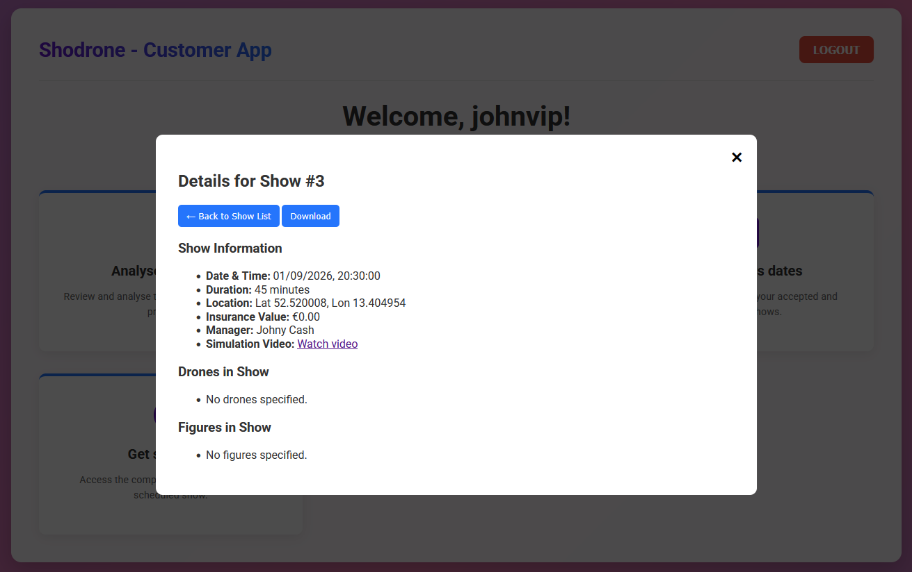

# US373 - Get Show Info

## 1. Context

This README covers the implementation of user story US373 for retrieving detailed information about shows in the system.

### 1.1 List of issues

* US373 Issues: [GitHub issues link](https://github.com/orgs/Departamento-de-Engenharia-Informatica/projects/1100/views/1?pane=issue&itemId=111563988&issue=Departamento-de-Engenharia-Informatica%7Csem4pi-2024-2025-sem4pi_2024_2025_g39%7C345)

## 2. Requirements

### US373 - Get Show Info

As a Customer, I want to get the details of a show (scheduled or in the past), including the drone models, figures, duration, etc.

**Acceptance Criteria:**
- n/a

## 3. Analysis

### 3.1 Business Rules

* Authorization Rules:
    * Only authenticated users with CUSTOMER_REPRESENTATIVE role can access show details
    * Users can only view shows associated with their customer

* Show Details Rules:
    * Show details include:
        * Basic information (ID, date/time, duration, location)
        * Insurance value
        * Manager information (first name, last name)
        * Simulation video link
        * List of drones with quantities
        * List of figures with descriptions
    * Shows can be either scheduled or past shows
    * All show details must be retrieved in a single request
    * The system should handle cases where some information might be missing

## 4. Design

### 4.1 Architecture

* Client-Server Architecture:
    * Customer App (Client):
        * Web-based frontend using HTML, CSS, and JavaScript
        * Communicates with Customer App Server via HTTP
        * No direct database access
        * Handles user interface and client-side validation
    * Customer App Server:
        * Java-based HTTP server using Berkeley Sockets API
        * Implements HTTP protocol over TCP
        * Handles client requests and database operations
        * Manages authentication and authorization
    * Database:
        * H2 Database accessed only by Customer App Server
        * Stores show proposals, customer data, and user credentials

* Communication Protocol:
    * HTTP over TCP sockets
    * Stateless request-response model
    * Endpoints:
        * GET /show/details?id={showId} - Retrieve show details
        * GET /shows/scheduled?user={username} - List scheduled shows
        * POST /login - Authentication
    * Security:
        * Role-based access control (CUSTOMER_REPRESENTATIVE)
        * Session management using browser's sessionStorage
        * No direct database access from client

* Component Interaction:
    * Customer App → Customer App Server:
        * HTTP requests for show details
        * Authentication requests
        * Show listing requests
    * Customer App Server → Database:
        * SQL queries for show information
        * User authentication verification
        * Customer association checks

## 5. Implementation

### Core Components

* Server Components:
    * `CustomerAppHttpServer.java`:
        * Main HTTP server implementation
        * TCP socket management
        * Request handling initialization
    * `CustomerAppRequest.java`:
        * HTTP request processing
        * Show details retrieval logic
        * Database interaction
        * Authorization checks
    * `HTTPmessage.java`:
        * HTTP protocol implementation
        * Request/response handling
        * Content type management

* Client Components:
    * `dashboard.html`:
        * Main application interface
        * Show details display
        * User interaction elements
    * `dashboard.js`:
        * HTTP client implementation
        * Show details fetching
        * UI state management
        * Error handling
    * `auth.js`:
        * Authentication handling
        * Session management
        * Login/logout functionality

## 6. Integration/Demonstration

* The system integrates show details retrieval in the following ways:
  1. Customer Application:
     * Menu option for viewing show details
     * List of available shows for selection
     * Detailed view of selected show information
     * Download option for proposal text
     * Video link access for simulation preview

## 7. Testing

### 7.1 Functional Tests

#### Test Case: Get Show Details
**ID:** #373
**Description:** Retrieve detailed information about a show

**Prerequisites:**
1. Authenticate as Customer Representative
2. Have at least one show associated with the customer

**Test Steps:**
1. View show details normally
   1. Select a show from the list
   2. Verify all show details are displayed:
      - Basic information (ID, date/time, duration, location)
      - Insurance value
      - Manager information
      - Simulation video link
      - List of drones with quantities
      - List of figures with descriptions
   3. Verify proposal text can be downloaded
   4. Verify simulation video link is accessible

2. Attempt to access unauthorized shows
   1. Try to access shows from other customers
   2. System should not show these shows in the list

3. Verify data presentation
   1. Check date/time formatting
   2. Verify coordinate precision
   3. Confirm proper display of drone quantities
   4. Validate figure descriptions formatting

### 7.2 How to use

## 8. Observations

* The show details retrieval process is secure and role-based
* The system maintains proper data separation between customers
* All show information is retrieved in a single request for efficiency
* The UI provides a user-friendly way to access and view show details
* The system handles missing or null values gracefully
* Show details include both basic information and complex data structures (drones, figures)
* The implementation supports both scheduled and past shows
* The system provides download functionality for proposal text
* Video links are properly integrated for simulation preview
