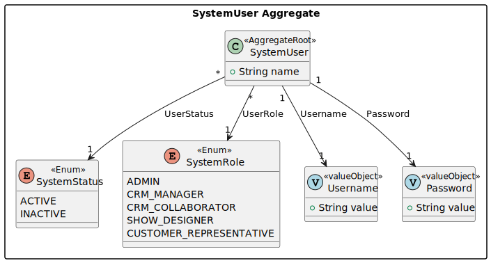
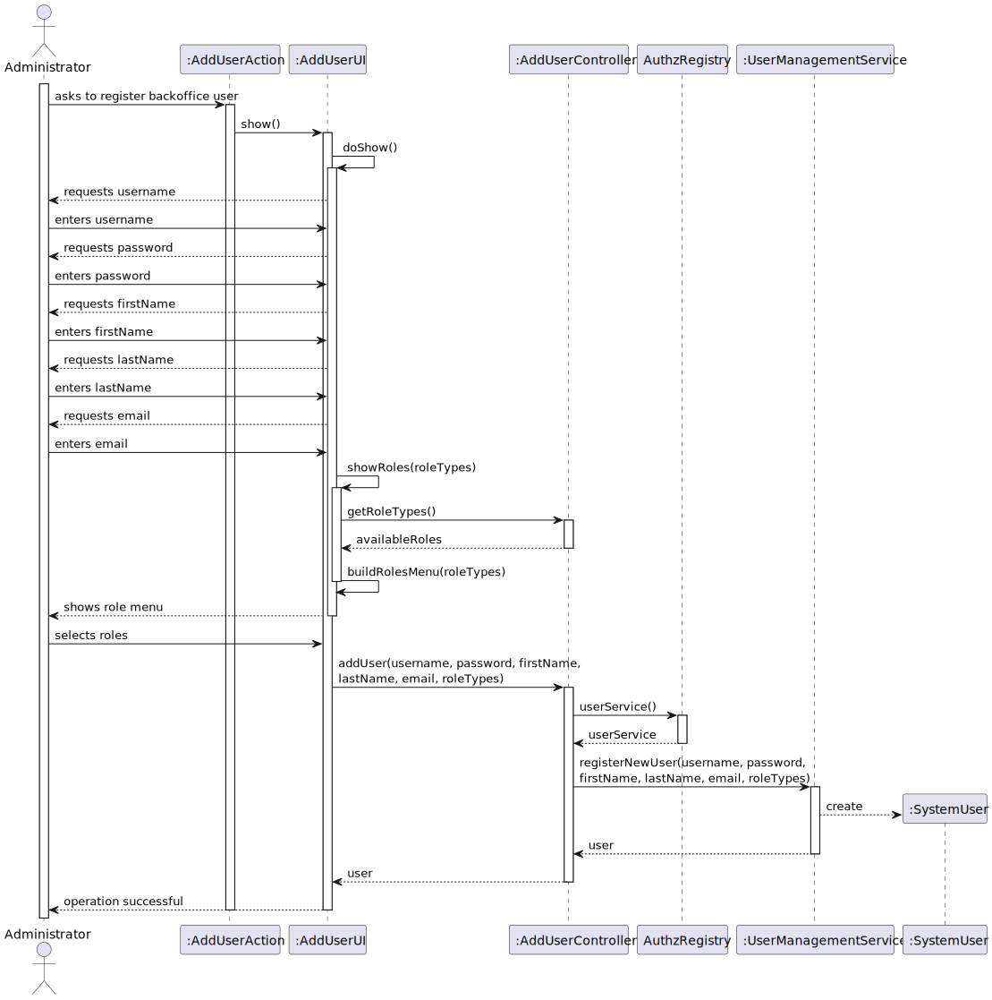
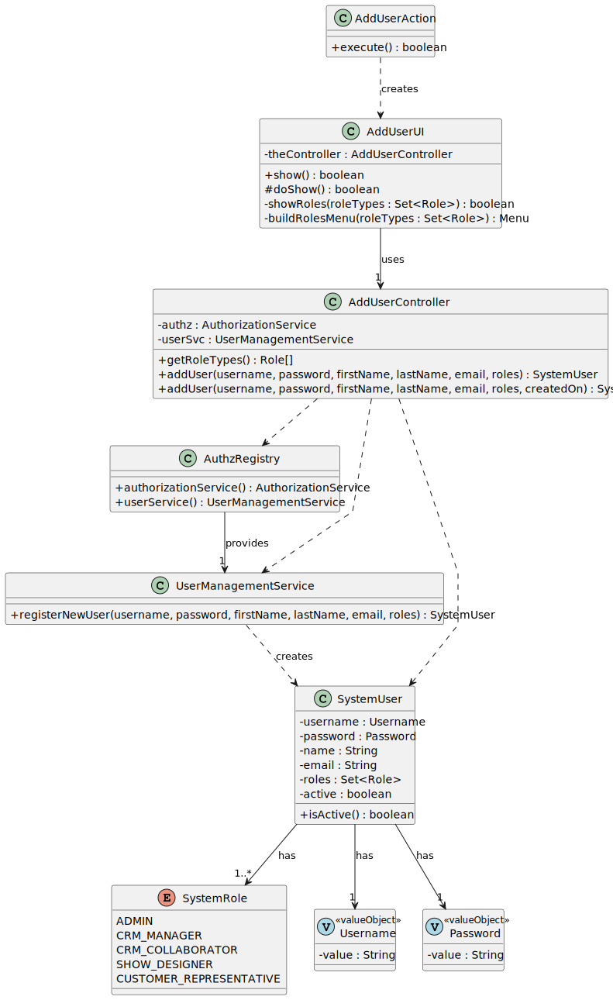
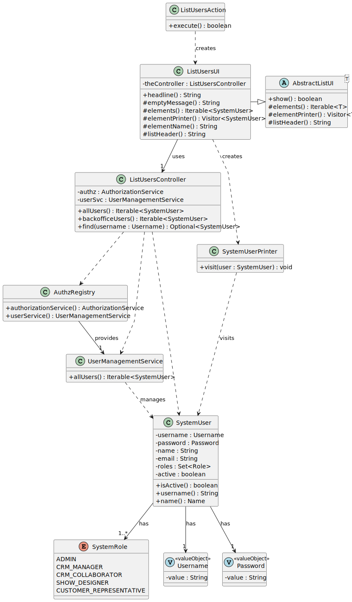

# Authentication and User Management US's

## 1. Context

This README covers the implementation of user stories US210 through US213 for authentication and user management in the backoffice system.

### 1.1 List of issues

* [US210 - Authentication and authorization](https://github.com/Departamento-de-Engenharia-Informatica/sem4pi-2024-2025-sem4pi_2024_2025_g39/issues/7)
* [US211 - Register users](https://github.com/Departamento-de-Engenharia-Informatica/sem4pi-2024-2025-sem4pi_2024_2025_g39/issues/8)
* [US212 - Disable/enable users](https://github.com/Departamento-de-Engenharia-Informatica/sem4pi-2024-2025-sem4pi_2024_2025_g39/issues/9)
* [US213 - List users](https://github.com/Departamento-de-Engenharia-Informatica/sem4pi-2024-2025-sem4pi_2024_2025_g39/issues/10)

## 2. Requirements

### US210 - Authentication and authorization

**As** Project Manager
**I want** the system to support and apply authentication and authorization for all its users and functionalities.

**Acceptance Criteria:**
- n/a

### US211 - Register users

**As** Administrator
**I want** to be able to register backoffice users, both via UI and bootstrap script.

**Acceptance Criteria:**
- This must also be achieved by a bootstrap process

### US212 - Disable/enable users

**As** Administrator
**I want** to be able to disable or enable backoffice users.

**Acceptance Criteria:**
- n/a

### US213 - List users

**As** Administrator
**I want** to list all backoffice users including their status.

**Acceptance Criteria:**
- n/a

## 3. Analysis

*Common for all US210–US213*

## 4. Design

### US210 - Authentication and authorization
- **Sequence Diagram**

- **Class Diagram**

### US211 - Register users
- **Sequence Diagram**

- **Class Diagram**

### US212 - Disable/enable users
- **Sequence Diagram**

- **Class Diagram**

### US213 - List users
- **Sequence Diagram**

- **Class Diagram**

## 5. Implementation

*Common for all US210–US213*

### Implementations

* Developed role-specific menu structures:
  * `AdminMenu` - User management operations for administrators
  * `CollaboratorMenu` - Customer and show request management
  * `ManagerMenu` - Figure management operations
* Each menu implements proper role-based access control and operation segregation
* Menus are integrated with EAPLI's menu framework using `Menu` and `Actions` classes

### EAPLI Base Components

* Core user management functionality from EAPLI framework:
  * `ActivateUserController`, `AddUserController`, `DeactivateUserController`, `ListUsersController`
  * `PasswordPolicy` for password validation and strength checking
  * `Roles` for role definitions and management
  * `UserBuilderHelper` for user creation
* Console-based UI classes following EAPLI patterns:
  * `AddUserUI` - Handles user registration with role selection
  * `ActivateUserUI` - Manages user activation with filtering
  * `DeactivateUserUI` - Manages user deactivation
  * `ListUsersUI` - Displays users with their status
* Each UI has a corresponding Action class implementing EAPLI's Action interface
* Used EAPLI's built-in domain models and services:
  * `SystemUser` for user entity
  * `Role` for user roles
  * `AuthorizationService` and `UserManagementService` for core operations

## 6. Integration/Demonstration

*Common for all US210–US213*

* Successfully integrated with EAPLI framework's authentication and authorization system
* Console application demonstrates the following flows:
  1. User Registration (US211)
     * Add new backoffice users with role selection
  2. User Status Management (US212)
     * Activate/deactivate users via console interface
  3. User Listing (US213)
     * Table format display with username, name, and status

## 7. Observations

- n/a