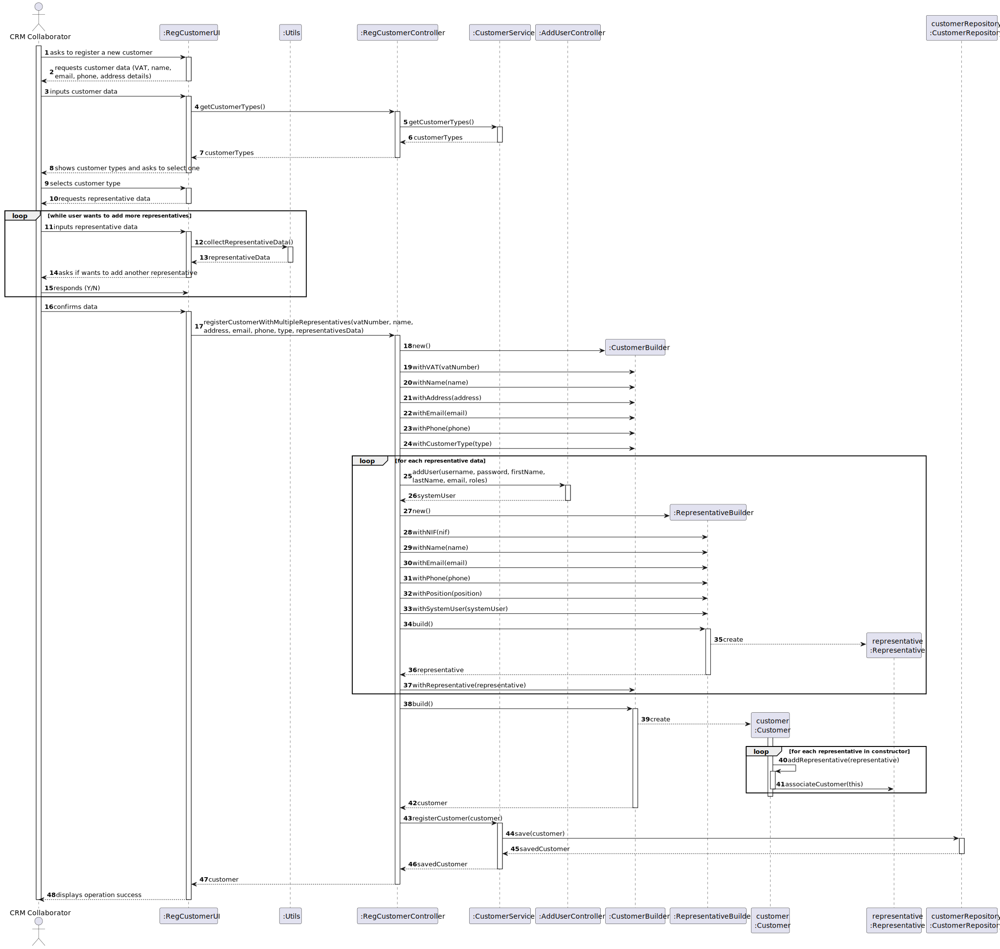
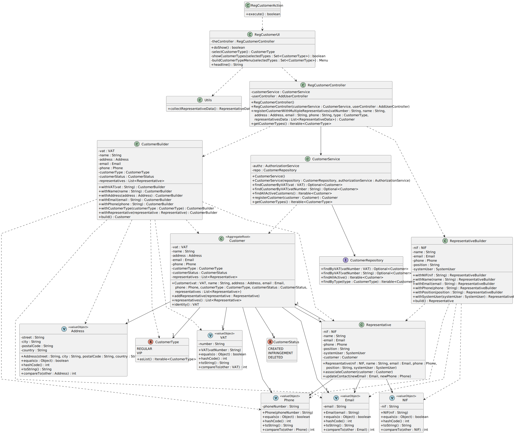

# US220 - Customer Registration

## 1. Context

This README covers the implementation of user story US220 for customer registration in the system.

### 1.1 List of issues

* Analysis: [GitHub issue link](https://github.com/Departamento-de-Engenharia-Informatica/sem4pi-2024-2025-sem4pi_2024_2025_g39/issues/140)

* Design: [GitHub issue link](https://github.com/Departamento-de-Engenharia-Informatica/sem4pi-2024-2025-sem4pi_2024_2025_g39/issues/141)

* Implement: [GitHub issue link](https://github.com/Departamento-de-Engenharia-Informatica/sem4pi-2024-2025-sem4pi_2024_2025_g39/issues/142)

* Test: [GitHub issue link](https://github.com/Departamento-de-Engenharia-Informatica/sem4pi-2024-2025-sem4pi_2024_2025_g39/issues/143)

## 2. Requirements

### US220 - Register customer

**As** CRM Collaborator
**I want** to register a customer, and that the system automatically creates a customer representative for that customer.

**Acceptance Criteria:**
- **US220.1:** This must also be achieved by a bootstrap process. 
- **US220.2:** The customer representative will also be a user of the system (Customer App).

## 3. Analysis

### **US220 DM Excerpt** 

## 4. Design

### 4.1. Customer Registration

- **Sequence Diagram**

- **Class Diagram**

### 4.2. Applied Patterns

* Domain-Driven Design (DDD):
  * Aggregate Root (Customer)
  * Value Objects
  * Repositories
  * Builders

* GRASP:
  * Controller
  * Information Expert
  * Creator
  * Low Coupling
  * High Cohesion

## 5. Implementation

### Core Components

* Customer Management:
  * `RegCustomerController` - Handles customer registration process
  * `CustomerService` - Manages customer-related operations
  * `CustomerBuilder` - Creates valid customer objects
  * `RepresentativeBuilder` - Creates valid representative objects
  

* Domain Models:
  * `Customer` - Aggregate root with VAT identifier
  * `Representative` - Entity linked to Customer
  * Value Objects: `VAT`, `NIF`, `Email`, `Phone`, `Address`
  

* Repository Layer:
  * `CustomerRepository` - Data access interface
  * `JpaCustomerRepository` - JPA implementation
  * `InMemoryCustomerRepository` - In-memory implementation

### UI Components

* Console-based UI classes:
  * `RegCustomerUI` - Handles customer registration
  * `RegCustomerAction` - Menu action implementation
  * `CollaboratorMenu` - Menu integration

## 6. Integration/Demonstration

* The system integrates customer registration in three ways:
  1. Backoffice Application:
     * Menu option for CRM Collaborator to register customers
     * Simple form to collect customer data

  2. Customer Application:
     * Customer Representatives can access Customer App

  3. Bootstrap:
     * Creates initial test customers and representatives

## 7. Observations

- n/a