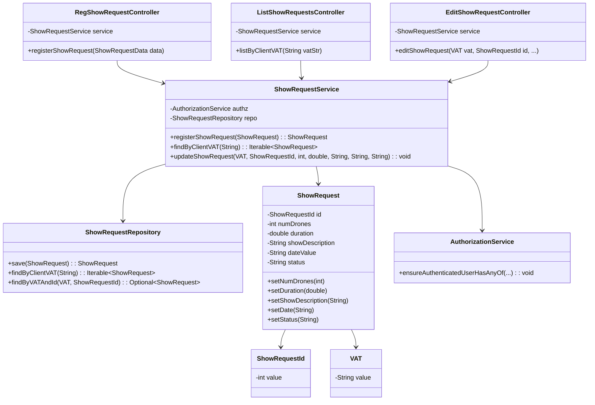

# Class Diagram - Show Request Management

## Description

This class diagram illustrates the main components for the Show Request Management system:

1. **Controllers**:
    - `RegShowRequestController`: Initiates a new show request registration.
    - `ListShowRequestsController`: Retrieves all requests for a given client VAT.
    - `EditShowRequestController`: Allows modification of an existing show request.

2. **Application Service**:
    - `ShowRequestService`: Contains business logic and ensures authorization before delegating to the repository.

3. **Repositories and Domain Entities**:
    - `ShowRequestRepository`: Interface to fetch and persist `ShowRequest` data.
    - `ShowRequest`: Core entity representing a show request.
    - `ShowRequestId` & `VAT`: Domain value objects encapsulating identification.

4. **Infrastructure**:
    - `AuthorizationService`: Verifies user roles to allow operations.
