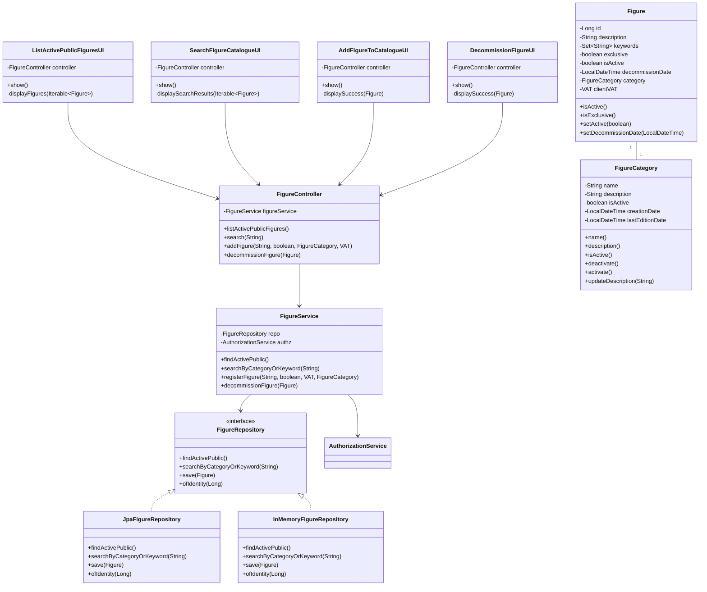

# Class Diagram - Figure Management

## Description

This class diagram shows the main components involved in the Figure Management system:

1. **User Interfaces**:
   - `ListActivePublicFiguresUI`: Displays active public figures
   - `SearchFigureCatalogueUI`: Handles figure search functionality
   - `AddFigureToCatalogueUI`: Manages figure addition to catalogue
   - `DecommissionFigureUI`: Handles figure decommissioning

2. **Controllers**:
   - `FigureController`: Coordinates figure management operations
   - `FigureService`: Implements business logic for figure operations

3. **Domain Objects**:
   - `Figure`: Represents a figure entity with its properties
   - `FigureCategory`: Represents a category for figures

4. **Repositories**:
   - `FigureRepository`: Interface for figure data access
   - `JpaFigureRepository`: JPA implementation of figure repository
   - `InMemoryFigureRepository`: In-memory implementation for testing

The system follows a layered architecture with clear separation of concerns:
- Presentation Layer (UIs)
- Application Layer (Controllers and Services)
- Domain Layer (Figure and FigureCategory)
- Persistence Layer (Repositories) 